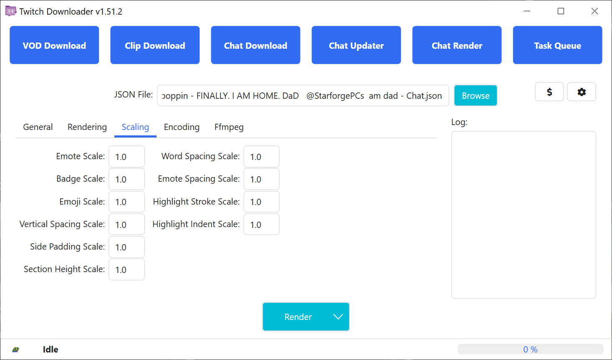
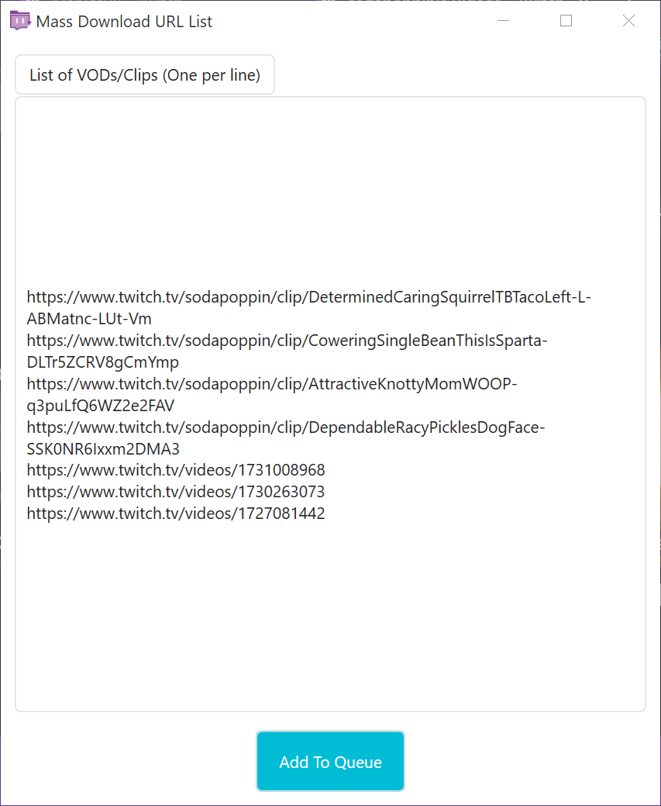

# TwitchDownloaderWPF
A Windows WPF desktop application that implements the core functionality wrapped in various quality of life features.

- [TwitchDownloaderWPF](#twitchdownloaderwpf)
  - [Usage](#usage)
    - [VOD Download](#vod-download)
    - [Clip Download](#clip-download)
    - [Chat Download](#chat-download)
    - [Chat Updater](#chat-updater)
    - [Chat Render](#chat-render)
      - [General](#general)
      - [Rendering](#rendering)
      - [Scaling](#scaling)
      - [Encoding](#encoding)
      - [Ffmpeg](#ffmpeg)
      - [Optimizing Render Speeds](#optimizing-render-speeds)
    - [Task Queue](#task-queue)
    - [Settings](#settings)
  - [Troubleshooting](#troubleshooting)
    - [Non-Error Issues](#non-error-issues)
    - [Common Errors](#common-errors)
    - [Uncommon Errors](#uncommon-errors)
  - [Localization](#localization)
  - [Theming](#theming)

---

## Usage

Most of the pages contain an information area on the left side of window, showing the thumbnail (if available), streamer, creation date, and title of the VOD/clip, the center of the window contains the settings for the job, and the right side of the window contains an area for logging events.

### VOD Download
<sup>Downloads a stream VOD or highlight from Twitch</sup>


<sup>*Figure 1.1*</sup>

To get started, input a valid link or ID to a VOD or highlight. If the VOD or highlight is private or sub-only, then an OAuth token from an account with access to the video is required. From there the download options will unlock, allowing you to customize the job.

**Quality**: Selects the quality of the download and provides an estimated file size. Occasionally Twitch calls the highest quality as 'Source' instead of the typical resolution formatting (1080p60 in the case of figure 1.1).

**Crop Video**: Sets the start and end time to crop the video download in the format [hours] [minutes] [seconds]. Cropping the video will result in a smaller total download.

**Download Threads**: The amount of download threads to be dispatched.

**OAuth**: The authorization token to allow downloading sub-only and private VODs or highlights. It is required by us and Twitch in order to prevent unauthorized downloads of paid or private content. Learn how to get your OAuth token at the following video: [https://youtu.be/1MBsUoFGuls](https://www.youtube.com/watch?v=1MBsUoFGuls). <ins>**DO NOT SHARE YOUR OAUTH TOKEN WITH ANYONE**</ins>

**Download**: Starts the download job. If instead you open the dropdown, you can send it to the [Task Queue](#task-queue) with the *Enqueue* option. The current download settings will be used in both scenarios.

### Clip Download
<sup>Downloads a clip from Twitch</sup>


<sup>*Figure 2.1*</sup>

To get started, input a valid link or ID to a clip. From there the the download options will unlock, allowing you to customize the job.

**Quality**: Selects the quality of the clip before downloading.

**Download** Starts the download job. If instead you open the dropdown, you can send it to the [Task Queue](#task-queue) with the *Enqueue* option. The current download settings will be used in both scenarios.

### Chat Download
<sup>Downloads the chat of a VOD, highlight, or clip</sup>


<sup>*Figure 3.1*</sup>

<sup>*Figure 3.2*</sup>

To get started, input a valid link or ID to a VOD, highlight, or clip. From there the download options will unlock, allowing you to customize the job. If the VOD or highlight is sub-only or private, then it cannot have the chat downloaded. This is a limitation of the Twitch API, not TwitchDownloader.

**Download Format**: The file format the downloaded chat will be saved in.
- `JSON` outputs a rich version of the chat that can be used for updating and rendering.
- `Text` outputs a raw text version of the chat ideal for simply reading while watching a VOD.
- `HTML` outputs a local webpage that emulates the look of the Twitch website.

**Compression** (JSON only): Compresses the output JSON using the GZip compression standard, allowing for 40-90% file size reductions. Not recommended if you want to manually edit values in the chat file without using the [Chat Updater](#chat-updater).

**Timestamp Format** (Text only): Changes the timestamp format in the text download. The choices are `UTC`, `Relative` to the start of the video, and `None`.

**Crop**: Sets the start and end time to crop the chat download in the format [hours] [minutes] [seconds]. Cropping the chat will result in a smaller total download.

**Embed Images** (JSON & HTML only): Downloads the emotes and badges of the streamer and saves them inside the downloaded chat. File size will be much larger.

**3rd Party Emotes** (JSON & HTML only): Also download emotes from the specified 3rd party providers and save them inside the chat. If the streamer is not registered on a given provider then it is skipped.

**Connections**: The amount of download threads to be dispatched. On some internet connections, Twitch servers may refuse using more than 1 chat download thread.

**Download**: Starts the download job. If instead you open the dropdown, you can send it to the [Task Queue](#task-queue) with the *Enqueue* option. The current download settings will be used in both scenarios.

### Chat Updater
<sup>Updates the embedded emotes, badges, bits, and crops of a JSON chat download and/or converts a JSON chat to another format</sup>


<sup>*Figure 4.1*</sup>

To get started, click the **Browse** button and navigate to a previously downloaded JSON chat. From there the update options will unlock, allowing you to customize the job. If the source video of the chat still exists, its information will be loaded in the information section.

**Download Format**: The file format the updated chat will be saved in.
- `JSON` outputs a rich version of the chat that can be used for updating and rendering.
- `Text` outputs a raw text version of the chat ideal for simply reading while watching a VOD.
- `HTML` outputs a local webpage that emulates the look of the Twitch website.

**Compression** (JSON only): Compresses the output JSON using the GZip compression standard, allowing for 40-90% file size reductions. Not recommended if you want to manually edit values in the chat file without using the [Chat Updater](#chat-updater).

**Timestamp Format** (Text only): Changes the timestamp format in the text chat. The choices are `UTC`, `Relative` to the start of the video, and `None`.

**Crop**: Sets the start and end time to crop the updated chat in the format [hours] [minutes] [seconds]. Expanding the crops of a chat will cause the updater to try and fetch comments that were not originally included in the download. Shrinking the crops of a chat will not remove any comments.

**Embed Missing** (JSON & HTML only): Downloads any emotes or badges that were not originally included in the input JSON chat. Existing emotes or badges will NOT be overwritten.

**Replace Embeds** (JSON & HTML only): Discards all existing emotes and badges from the input JSON chat and downloads the current emotes and badges.

**3rd Party Emotes** (JSON & HTML only): Also download emotes from the specified 3rd party providers and save them inside the chat. If the streamer is not registered on a given provider then it is skipped.

**Update**: Starts the update job. If instead you open the dropdown, you can send it to the [Task Queue](#task-queue) with the *Enqueue* option. The current update settings will be used in both scenarios.

### Chat Render
<sup>Renders a chat JSON as a video</sup>


<sup>*Figure 5.1*</sup>

<sup>*Figure 5.2*</sup>

<sup>*Figure 5.3*</sup>

<sup>*Figure 5.4*</sup>

<sup>*Figure 5.5*</sup>

<sup>*Figure 5.6*</sup>

To get started, click the **Browse** button and navigate to a previously downloaded JSON chat. From there you may edit the render options to customize the job.

**Render**: Starts the render job. If instead you open the dropdown, you can send it to the [Task Queue](#task-queue) with the *Enqueue* option. Alternatively you can also select 
the *Partial Render* option to render a smaller section of the chat, see Figure 5.6. The current render settings will be used in all scenarios.

#### <ins>General</ins>

**Width**: The width of the output chat render. Must be an even number.

**Height**: The height of the output chat render. Must be an even number.

**Font**: The font used in the output chat render. The Twitch website uses *Inter*, which is bundled with TwitchDownloader as *Inter Embedded*.

**Font Size**: The size of the font.

**Font Color**: The font color of messages.

**Background Color**: The background color of the output chat render.

#### <ins>Rendering</ins>

**Outline**: Adds a thin black outline to usernames and messages.

**Timestamps**: Draws a timestamp relative to the start of the video next to chat messages.

**Sub Messages**: Draws of sub, resub, and sub gift messages. If disabled they will be filtered out of the render.

**Chat Badges**: Draws chat badges next to usernames.

**Update Rate**: The time in seconds between drawing the next batch of comments. Lower numbers makes chat flow more readable but will marginally increase render times.

**Dispersion**: In November 2022 a Twitch API change made chat messages download only in whole seconds. If dispersion is enabled and there are multiple messages on a second, they will be intelligently distributed over the second to improve chat flow. Requires an update rate less than 1.0 for effective results.

**BTTV Emotes**: Enables emotes from BTTV in the render.

**FFZ Emotes**: Enables emotes from FFZ in the render.

**7TV Emotes**: Enables emotes from 7TV in the render.

**Offline**: Render without making a single network request; use only information and images embedded inside the chat JSON.

**Chat Badge Filter**: Do not render the specified badges. For example in Figure 5.2, the *No Audio* or *No Video* badges will never be rendered.

**Ignore Users List**: A comma-separated, case-insensitive list of users to be removed from the render. For example, in Figure 5.2 Streamlabs, StreamElements, and Nightbot will be removed from the render.

**Banned Words List**: A comma-separated, case-insensitive list of words that will cause messages to be removed from the render. For example, in Figure 5.2 any message that contains `' pog '`, `'[pOg+'`, `'/POg9'` will be removed from the render. Any message that contains `' poggers '` will not be removed.

#### <ins>Scaling</ins>

**Emote Scale**: The scale of emotes.

**Badge Scale**: The scale of badges.

**Emoji Scale**: The scale of emojis.

**Vertical Spacing Scale**: The scale of the space between messages.

**Side Padding Scale**: The scale of the horizontal padding.

**Section Height Scale**: The scale of a line of text.

**Word Spacing Scale**: The scale of the space between words.

**Emote Spacing Scale**: The scale of the padding between emotes and other emotes or words.

**Highlight Stroke Scale**: The scale of the width of the highlighted/sub message sidebar.

**Highlight Indent Scale**: The scale of the indenting of highlighted/sub messages.

#### <ins>Encoding</ins>

**File Format**: The file format of the output render.

**Codec**: The codec used by the output render.

**Framerate**: The framerate of the output render.

**Generate Mask**: Generates a secondary output file containing a black and white mask of the text and images in the render. The alpha channel of the background color MUST be less than 255.

#### <ins>Ffmpeg</ins>

**Warning: modifying Ffmpeg arguments may cause pipe errors!**

**Input Arguments**: The arguments for controlling the rendered input to ffmpeg.

**Output Arguments**: The arguments for controlling the encoded output from ffmpeg.

**Reset To Defaults**: Reset both of the Ffmpeg arguments to default.

#### <ins>Optimizing Render Speeds</ins>

If render speeds feel like they are too slow, try any of the following:
- Reduce render width
- Reduce render height
- Increase update rate
- Disable dispersion if update rate is less than 1.0
- Reduce framerate
- Disable generate mask
- Disable BTTV, FFZ, 7TV emotes - animated emotes are expensive to render

### Task Queue
<sup>Create and manage multiple jobs</sup>


<sup>*Figure 6.1*</sup>

<sup>*Figure 6.2*</sup>

<sup>*Figure 6.3*</sup>

<sup>*Figure 6.4*</sup>

<sup>*Figure 6.5*</sup>

The Task Queue allows for many jobs to work sequentially or in parallel. Any job from the other 5 pages can be sent to the Task Queue via their respective *Enqueue* buttons, see Figure 6.5.

On the Task Queue page, there are 4 limiters:

**VOD Downloads**: The amount of VOD/highlight downloads that can occur simultaneously.

**Clip Downloads**: The amount of clip downloads that can occur simultaneously.

**Chat Downloads**: The amount of chat downloads/updates that can occur simultaneously.

**Chat Renders**: The amount of chat renders that can occur simultaneously.

The Task Queue also features 3 types of mass downloading:

**URL List**: A list of VOD, highlight, or clip URLs that will all be processed with the same enqueue settings. See Figure 6.2 and Figure 6.5.

**Search VODs**: A window to search all VODs from a streamer that will all be processed with the same enqueue settings. See Figure 6.3 and Figure 6.5.

**Search Clips**: A window to search all clips from a streamer that will all be processed with the same enqueue settings. See Figure 6.3 and Figure 6.5.

### Settings


<sup>*Figure 7.1*</sup>

**Cache Folder**: The directory where temporary working files are stored. This includes VOD downloads, emotes, badges, and cheermotes.
- Clear: Deletes all TwitchDownloader related cache files. Not recommended unless the application isn't behaving correctly.
- Browse: Select a new folder to hold the temporary cache. Existing cache files will not be transferred.

**Hide Donation Button**: Hides the donation button.

**Verbose Errors**: Enables descriptive popups when an error occurs.

**Theme**: The application theme. See [Theming](#theming) for more details.

**Language**: The application language. See [Localization](#localization) for more details.

**Download Filename Templates**: The templates used to generate the default file names when downloading.

## Troubleshooting

### Non-Error Issues

Some issues are not considered to be errors. These should be reported as an [issue on github](https://github.com/lay295/TwitchDownloader/issues) along with the inputs used to cause the issue. Some examples of non-error issues include:
- Video downloads get stuck at `Downloading: 99%` for longer than 5 minutes
- Chat renders not updating status for more than 10 seconds
- Chat renders missing comments
- A UI element does not react to changing the application theme
- Changing an option, such as embed emotes, has no effect

### Common Errors

An error can be considered "common" if it has occurred before starting a job or immediately following the start of a job. A common error will also have friendly error message, sometimes accompanied by a popup, explaining what went wrong. Some examples of common errors include:
- Unable to find thumbnail
   - The VOD is either expired or currently live
- Unable to get Video/Clip information
   - The linked VOD/Clip is invalid, has been removed, or is private/sub-only and no valid OAuth was provided
- Unable to parse inputs
   - One or more render inputs are invalid, refer to log

### Uncommon Errors

An uncommon error can be characterized by a popup titled "Fatal Error" or an unfriendly error message. These should be reported as an [issue on github](https://github.com/lay295/TwitchDownloader/issues) along with the inputs used to cause the error. Some examples of uncommon errors include:
- Error converting value 'XXX' to type 'XXX'. Path 'XXX', line #, position #.
- Cannot access child value on Newtonsoft.Json.Linq.JValue.
- Response status code does not indicate success: 404 (Not Found).
- The pipe has been ended.
   - An issue occurred with Ffmpeg. Reset the arguments to default and try again. If still no success create a new issue on the github.

To help us find the origin of an error, please enable `Verbose Errors` in the [settings](#settings) and take a screen capture of the resulting popup titled "Verbose Error Output".

## Localization

The WPF application is available in multiple languages thanks to generous members of the community offering to translate it.

If you are confident in your ability to create a translation and TwitchDownloaderWPF is not available in your native language or the translation for your native language is incomplete, you are welcomed to help!

If you need assistance getting started, try reviewing the commit [53245be1fe55768d525905e81cc2cd0c12469b03](https://github.com/lay295/TwitchDownloader/blob/53245be1fe55768d525905e81cc2cd0c12469b03/TwitchDownloaderWPF/Services/AvailableCultures.cs), review [AvailableCultures.cs](Services/AvailableCultures.cs), review the original [localization thread](https://github.com/lay295/TwitchDownloader/issues/445), or make an [issue post](https://github.com/lay295/TwitchDownloader/issues/new/choose) asking for assistance.

If you are unsure on how to translate a string or a portion of a string, it can be left in English.

## Theming

Both a light and a dark theme are included with the application, along with an option to automatically switch between the 2 based on the current Windows app theme. Currently the light and dark themes are overwritten on every run to ensure they are always up to date.

To get started creating your own theme, simply duplicate one of the included themes and open it with your favorite text editor.

The WPF application uses some elements from a package called *HandyControl*, which do not provide full theming support. Most HandyControl elements only support text and border recoloring, meaning the backgrounds must be either white or dark. To control this, set the `DarkHandyControl` boolean key to true or false.

To enable dark title bars with your theme, set the `DarkTitleBar` boolean key to true.

The remaining `SolidColorBrush` keys control the colors of the application and application elements, such as the app background, text, and border colors. The 'Inner' keys are used to add depth to recursive elements, as seen in the following diagram:

```
/---------------------------[-][#][x]
|           AppBackground           |
| /-------------------------------\ |
| |     AppElementBackground      | |
| | /---------------------------\ | |
| | | AppInnerElementBackground | | |
| | |                           | | |
| | \---------------------------/ | |
| |                               | |
| \-------------------------------/ |
|                                   |
\-----------------------------------/
```

In this case `AppElementBackground` is being used by a frame, while `AppInnerElementBackground` is being used by a bordered label, blank image background, or similar.

**Important Notes**

- `Dark.xaml` and `Light.xaml` will always be overwritten on application launch.
- File names are read in case-insensitive manner, meaning `Dark.xaml` and `dark.xaml` cannot be differentiated.
- Don't forget to edit the author comment at the top of the theme file!
- You can have your theme included with the program! Upload it to your own fork of TwitchDownloader and create a pull request https://github.com/lay295/TwitchDownloader/pulls.

For offline instructions on creating custom themes see [`Themes/README.txt`](Themes/README.txt), which is regenerated on every run.