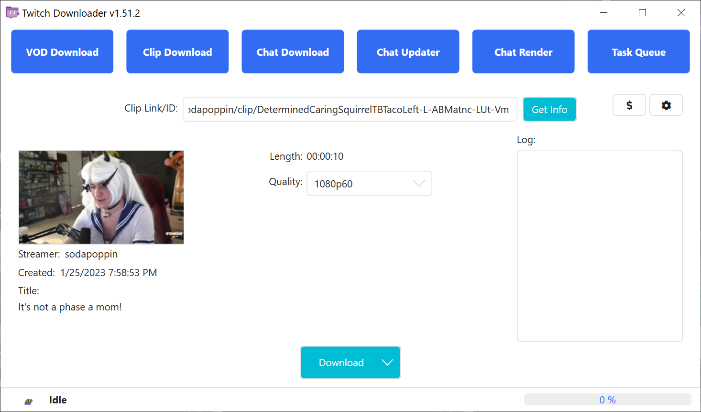
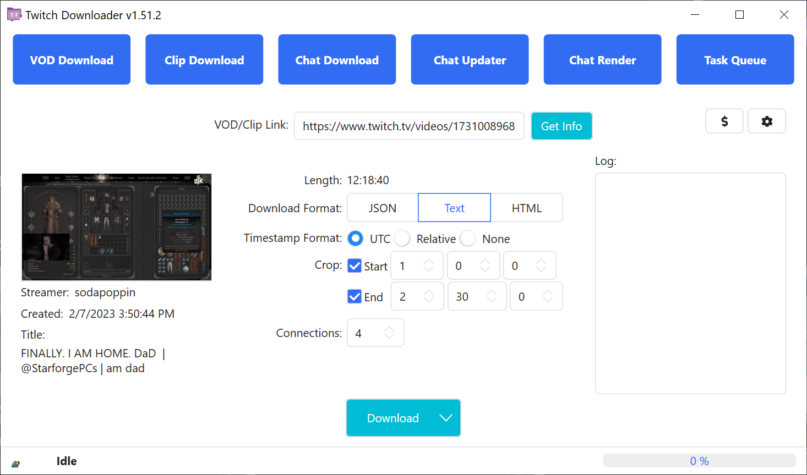
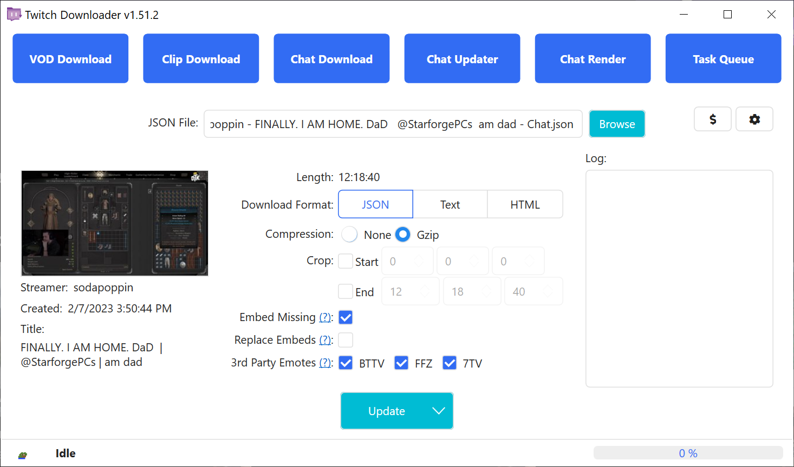
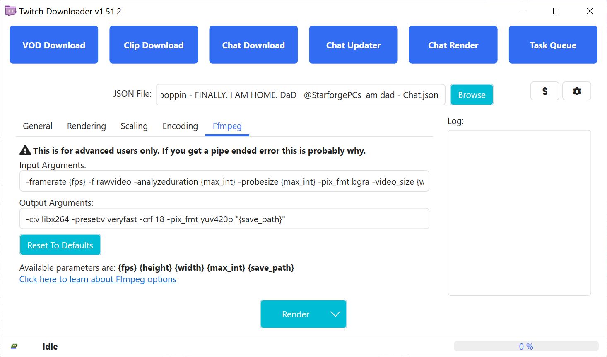

> [!WARNING]
> Die deutsche README von TwitchDownloaderWPF könnte veraltet sein.
> Für die aktuellste Version schaue bitte in die [englische ](README.md) README.

# TwitchDownloaderWPF

Eine Windows-WPF-Desktopanwendung, die die Kernfunktionen in verschiedene Komfortfunktionen einbettet.

## Inhaltsverzeichnis

- [TwitchDownloaderWPF](#twitchdownloaderwpf)
  - [Inhaltsverzeichnis](#inhaltsverzeichnis)
  - [Verwendung](#verwendung)
    - [VOD-Download](#vod-download)
    - [Clip-Download](#clip-download)
    - [Chat-Download](#chat-download)
    - [Chat-Aktualisierung](#chat-aktualisierung)
    - [Chat-Rendering](#chat-rendering)
      - [Allgemeines](#allgemeines)
      - [Rendering](#rendering)
      - [Skalierung](#skalierung)
      - [Kodierung](#kodierung)
      - [FFmpeg](#ffmpeg)
      - [Rendergeschwindigkeit optimieren](#rendergeschwindigkeit-optimieren)
    - [Aufgabenwarteschlange](#aufgabenwarteschlange)
    - [Einstellungen](#einstellungen)
  - [Fehlerbehebung](#fehlerbehebung)
    - [Probleme ohne Fehlermeldung](#probleme-ohne-fehlermeldung)
    - [Häufige Fehler](#häufige-fehler)
    - [Seltene Fehler](#seltene-fehler)
  - [Lokalisierung](#lokalisierung)
  - [Designs](#designs)

---

## Verwendung

Die meisten Seiten enthalten auf der linken Seite des Fensters einen Informationsbereich, der das Vorschaubild (falls vorhanden), den Streamer, das Erstellungsdatum und den Titel des VOD/Clips anzeigt. In der Mitte des Fensters befinden sich die Einstellungen für den Auftrag, auf der rechten Seite befindet sich ein Bereich zur Protokollierung von Ereignissen.

### VOD-Download

Lädt ein VOD oder Highlight von Twitch herunter.


<br><sup>*Abbildung 1.1*</sup>

Gib eine gültige URL oder ID zu einem VOD oder Highlight ein, um zu beginnen. Falls das VOD oder Highlight privat oder nur für Abonnenten sichtbar ist, wird ein OAuth-Token eines Kontos benötigt, das Zugriff auf das Video hat. Danach werden die Downloadoptionen freigeschaltet und du kannst den Auftrag anpassen.

**Qualität**: Wählt die Downloadqualität und zeigt eine geschätzte Dateigröße an. Gelegentlich bezeichnet Twitch die höchste Qualität als „Source“ statt der üblichen Auflösungsschreibweise (z. B. 1080p60 in Abbildung 1.1).

**Trim-Modus**: Legt fest, wie der Videoschnitt gehandhabt wird. Videos, die mit dem exakten Schnitt zugeschnitten werden, können selten innerhalb der ersten/letzten Sekunden Bild- oder Tonstottern aufweisen. Der sichere Schnitt garantiert ruckelfreie Wiedergabe, kann aber ein etwas längeres Video ergeben.

**Trimmen**: Setzt Start- und Endzeit für den Videoschnitt im Format \[Stunden\] \[Minuten\] \[Sekunden\]. Durch das Trimmen verringert sich die Gesamtgröße des Downloads.

**Download-Threads**: Anzahl der parallelen Download-Threads, die gestartet werden.

**OAuth**: Das Autorisierungstoken, mit dem sub-only und private VODs oder Highlights heruntergeladen werden können. Es wird von uns und Twitch benötigt, um unbefugte Downloads kostenpflichtiger oder privater Inhalte zu verhindern. Eine Anleitung zum Abrufen deines OAuth-Tokens findest du im folgenden Video: [https://youtu.be/1MBsUoFGuls](https://www.youtube.com/watch?v=1MBsUoFGuls). <ins>**TEILE DEIN OAUTH-TOKEN MIT NIEMANDEM!**</ins>

**Download**: Startet den Downloadauftrag. Öffnest du stattdessen das Dropdown, kannst du ihn mit der Option *Zur Warteschlange hinzufügen* an die [Aufgabenwarteschlange](#aufgabenwarteschlange) senden. Die aktuellen Download-Einstellungen werden in beiden Fällen verwendet.

### Clip-Download

Lädt einen Clip von Twitch herunter.


<br><sup>*Abbildung 2.1*</sup>

Gib eine gültige URL oder ID zu einem Clip ein, um zu beginnen. Danach werden die Downloadoptionen freigeschaltet und du kannst den Auftrag anpassen.

**Qualität**: Wählt die Clipqualität vor dem Download.

**Metadaten kodieren**: Kodiert Clip-Metadaten wie Ausstrahlungsdatum und Clip-ID mithilfe von FFmpeg in die endgültige MP4-Datei.

**Download**: Startet den Downloadauftrag. Öffnest du stattdessen das Dropdown, kannst du ihn mit der Option *Zur Warteschlange hinzufügen* an die [Aufgabenwarteschlange](#aufgabenwarteschlange) senden. Die aktuellen Download-Einstellungen werden in beiden Fällen verwendet.

### Chat-Download

Lädt den Chat eines VOD, Highlights oder Clips herunter.


<br><sup>*Abbildung 3.1*</sup>


<br><sup>*Abbildung 3.2*</sup>

Gib eine gültige URL oder ID zu einem VOD, Highlight oder Clip ein, um zu beginnen. Danach werden die Downloadoptionen freigeschaltet und du kannst den Auftrag anpassen. Wenn das VOD oder Highlight nur für Abonnenten sichtbar oder privat ist, kann der Chat nicht heruntergeladen werden. Das ist eine Einschränkung der Twitch-API, nicht von TwitchDownloader.

**Downloadformat**: Dateiformat, in dem der heruntergeladene Chat gespeichert wird.

- `JSON` gibt eine umfangreiche Version des Chats aus, die zum Aktualisieren und Rendern verwendet werden kann.
- `Text` gibt eine reine Textversion des Chats aus, ideal zum Mitlesen beim Anschauen eines VODs.
- `HTML` erzeugt eine lokale Webseite, die das Erscheinungsbild der Twitch-Webseite emuliert.

**Komprimierung** (nur JSON): Komprimiert die ausgegebene JSON-Datei mithilfe des GZip-Standards und reduziert so die Dateigröße um 40–90 %. Nicht empfohlen, wenn du Chat-Dateien manuell bearbeiten möchtest, ohne den [Chat-Updater](#chat-aktualisierung) zu verwenden.

**Zeitstempelformat** (nur Text): Ändert das Zeitstempelformat im Text-Download. Zur Auswahl stehen `UTC`, relativ zum Beginn des Videos (`Relative`) und `None`.

**Trimmen**: Setzt Start- und Endzeit für den Chat-Download im Format \[Stunden\] \[Minuten\] \[Sekunden\]. Durch das Trimmen verringert sich die Gesamtgröße des Downloads.

**Bilder einbetten** (nur JSON & HTML): Lädt die Emotes und Abzeichen des Streamers herunter und speichert sie im Chat. Die Dateigröße steigt dadurch stark an.

**Emotes von Drittanbietern** (nur JSON & HTML): Lädt zusätzlich Emotes der angegebenen Drittanbieter herunter und speichert sie im Chat. Wenn der Streamer bei einem Anbieter nicht registriert ist, wird dieser übersprungen.

**Download-Threads**: Anzahl der parallelen Download-Threads. Bei manchen Internetverbindungen erlauben die Twitch-Server nicht mehr als einen Chat-Download-Thread.

**Download**: Startet den Downloadauftrag. Öffnest du stattdessen das Dropdown, kannst du ihn mit der Option *Zur Warteschlange hinzufügen* an die [Aufgabenwarteschlange](#aufgabenwarteschlange) senden. Die aktuellen Download-Einstellungen werden in beiden Fällen verwendet.

### Chat-Aktualisierung

Aktualisiert eingebettete Emotes, Abzeichen, Bits und Zuschnitte eines JSON-Chatdownloads und/oder konvertiert einen JSON-Chat in ein anderes Format.


<br><sup>*Abbildung 4.1*</sup>

Klicke auf **Durchsuchen** und navigiere zu einem zuvor heruntergeladenen JSON-Chat, um zu beginnen. Danach werden die Aktualisierungsoptionen freigeschaltet und du kannst den Auftrag anpassen. Wenn das Quellvideo des Chats noch existiert, werden seine Informationen im Informationsbereich geladen.

**Downloadformat**: Dateiformat, in dem der aktualisierte Chat gespeichert wird.

- `JSON` gibt eine umfangreiche Version des Chats aus, die zum Aktualisieren und Rendern verwendet werden kann.
- `Text` gibt eine reine Textversion des Chats aus, ideal zum Mitlesen beim Anschauen eines VODs.
- `HTML` erzeugt eine lokale Webseite, die das Erscheinungsbild der Twitch-Webseite emuliert.

**Komprimierung** (nur JSON): Komprimiert die ausgegebene JSON-Datei mithilfe des GZip-Standards und reduziert so die Dateigröße um 40–90 %. Nicht empfohlen, wenn du Chat-Dateien manuell bearbeiten möchtest, ohne den [Chat-Updater](#chat-aktualisierung) zu verwenden.

**Zeitstempelformat** (nur Text): Ändert das Zeitstempelformat im Text-Chat. Zur Auswahl stehen `UTC`, relativ zum Beginn des Videos (`Relative`) und `None`.

**Trimmen**: Setzt Start- und Endzeit für den aktualisierten Chat im Format \[Stunden\] \[Minuten\] \[Sekunden\]. Wird der Zeitraum erweitert, versucht der Updater Kommentare abzurufen, die im ursprünglichen Download nicht enthalten waren. Wird der Zeitraum verkürzt, werden keine Kommentare entfernt.

**Fehlendes einbetten** (nur JSON & HTML): Lädt alle Emotes oder Abzeichen nach, die im ursprünglichen JSON-Chat nicht enthalten waren. Bereits vorhandene Emotes oder Abzeichen werden **nicht** überschrieben.

**Einbettungen ersetzen** (nur JSON & HTML): Entfernt alle vorhandenen Emotes und Abzeichen aus dem JSON-Chat und lädt die aktuellen Emotes und Abzeichen herunter.

**Emotes von Drittanbietern** (nur JSON & HTML): Lädt zusätzlich Emotes der angegebenen Drittanbieter herunter und speichert sie im Chat. Wenn der Streamer bei einem Anbieter nicht registriert ist, wird dieser übersprungen.

**Aktualisieren**: Startet den Aktualisierungsauftrag. Öffnest du stattdessen das Dropdown, kannst du ihn mit der Option *Zur Warteschlange hinzufügen* an die [Aufgabenwarteschlange](#aufgabenwarteschlange) senden. Die aktuellen Aktualisierungseinstellungen werden in beiden Fällen verwendet.

### Chat-Rendering

Rendert einen Chat im JSON-Format als Video.


<br><sup>*Abbildung 5.1*</sup>


<br><sup>*Abbildung 5.2*</sup>


<br><sup>*Abbildung 5.3*</sup>


<br><sup>*Abbildung 5.4*</sup>


<br><sup>*Abbildung 5.5*</sup>


<br><sup>*Abbildung 5.6*</sup>

Klicke auf **Durchsuchen** und navigiere zu einem zuvor heruntergeladenen JSON-Chat, um zu beginnen. Anschließend kannst du die Renderoptionen anpassen.

**Rendern**: Startet den Renderauftrag. Öffnest du stattdessen das Dropdown, kannst du ihn mit der Option *Zur Warteschlange hinzufügen* an die [Aufgabenwarteschlange](#aufgabenwarteschlange) senden. Alternativ kannst du mit der Option *Teilrendering* einen kleineren Abschnitt des Chats rendern, siehe Abbildung 5.6. Die aktuellen Render-Einstellungen werden in allen Fällen verwendet.

#### <ins>Allgemeines</ins>

**Breite**: Breite der gerenderten Chat-Ausgabe. Muss eine gerade Zahl sein.

**Höhe**: Höhe der gerenderten Chat-Ausgabe. Muss eine gerade Zahl sein.

**Schriftart**: Schriftart, die im gerenderten Chat verwendet wird. Die Twitch-Webseite nutzt *Inter*, das als *Inter Embedded* mit TwitchDownloader ausgeliefert wird.

**Schriftgröße**: Größe der Schrift.

**Schriftfarbe**: Farbe der Nachrichten.

**Hintergrundfarbe**: Hintergrundfarbe der Chat-Ausgabe.

**Alternative Hintergrundfarbe**: Alternative Hintergrundfarbe für Nachrichten. Erfordert aktivierte *Alternative Hintergründe*.

#### <ins>Rendering</ins>

**Konturen**: Fügt Benutzernamen und Nachrichten einen dünnen schwarzen Umriss hinzu.

**Zeitstempel**: Zeichnet neben Chat-Nachrichten einen Zeitstempel relativ zum Start des Videos ein.

**Abonnenten-Nachrichten**: Zeigt Abonnements, Re-Subs und Geschenkabos an. Wenn deaktiviert, werden sie aus dem Render entfernt.

**Chat-Abzeichen**: Zeigt Chat-Abzeichen neben den Benutzernamen an.

**Aktualisierungsrate**: Zeit in Sekunden zwischen den nächsten Kommentarblöcken. Niedrigere Werte machen den Chat leichter lesbar, erhöhen aber die Renderzeit minimal.

**Dispersion**: Im November 2022 führte eine Änderung der Twitch-API dazu, dass Chatnachrichten nur noch sekundengenau heruntergeladen werden. Diese Option nutzt zusätzliche Metadaten, um zu versuchen, Nachrichten zu ihrem tatsächlichen Sendezeitpunkt wiederherzustellen. Dies kann eine andere Kommentarreihenfolge zur Folge haben. Erfordert eine Aktualisierungsrate unter 1,0 für effektive Ergebnisse.

**Alternative Hintergründe**: Wechselt die Hintergrundfarbe jeder zweiten Chat-Nachricht, um sie besser zu unterscheiden.

**Lesbarkeit der Benutzernamen erhöhen**: Erhöht den Kontrast zwischen Benutzernamen und Hintergrund ähnlich der Option _Readable Colors_ im Twitch-Chat. Wenn Render-Konturen aktiviert sind, erhöht diese Option den Kontrast der Benutzernamen gegenüber dem Umriss statt gegenüber dem Hintergrund.

**BTTV-Emotes**: Aktiviert BTTV-Emotes im Render.

**FFZ-Emotes**: Aktiviert FFZ-Emotes im Render.

**7TV-Emotes**: Aktiviert 7TV-Emotes im Render.

**Offline**: Rendert, ohne Netzwerkanfragen zu stellen; verwendet nur Informationen und Bilder, die im Chat-JSON eingebettet sind.

**Benutzer-Avatare**: Aktiviert Benutzer-Avatare im Render.

**Chat-Abzeichen-Filter**: Rendert die angegebenen Abzeichen nicht. In Abbildung 5.2 werden z. B. die Abzeichen *Kein Audio* und *Kein Video* nie angezeigt.

**Ignorierte Nutzer**: Kommagetrennte, nicht zwischen Groß- und Kleinschreibung unterscheidende Liste von Nutzern, die aus dem Render entfernt werden. In Abbildung 5.2 werden etwa Streamlabs, StreamElements und Nightbot entfernt.

**Liste verbotener Wörter**: Kommagetrennte, nicht zwischen Groß- und Kleinschreibung unterscheidende Liste von Wörtern, deren Auftreten Nachrichten aus dem Render entfernt. In Abbildung 5.2 wird jede Nachricht entfernt, die `" pog "`, `"[pOg+"` oder `"/POg9"` enthält. Eine Nachricht, die `" poggers "` enthält, wird nicht entfernt.

**Emoji-Anbieter**: Stil der im Render verwendeten Emojis. Derzeit werden _Twemoji_ von Twitter, _Noto Color_ von Google und die Emojis deines Systems (_None_) unterstützt.

#### <ins>Skalierung</ins>

**Emote-Skalierung**: Skalierung der Emotes.

**Abzeichen-Skalierung**: Skalierung der Abzeichen.

**Emoji-Skalierung**: Skalierung der Emojis.

**Avatar-Skalierung**: Skalierung der Avatare.

**Kontur-Skalierung**: Dicke der Render-Konturen.

**Vertikale Abstands-Skalierung**: Skalierung des Abstands zwischen Nachrichten.

**Seitliche Abstands-Skalierung**: Skalierung der horizontalen Abstände.

**Abschnittshöhen-Skalierung**: Skalierung der Höhe einer Textzeile.

**Wortabstands-Skalierung**: Skalierung des Abstandes zwischen Wörtern.

**Emote-Abstands-Skalierung**: Skalierung des Abstandes zwischen Emotes und anderen Emotes oder Wörtern.

**Markierungsbalken-Skalierung**: Skalierung der Breite der Seitenleiste für hervorgehobene/Abonnenten-Nachrichten.

**Markierungseinzug-Skalierung**: Skalierung des Einzugs von hervorgehobenen/Abonnenten-Nachrichten.

#### <ins>Kodierung</ins>

**Dateiformat**: Dateiformat der gerenderten Ausgabe.

**Codec**: Codec der gerenderten Ausgabe.

**Bildrate**: Bildrate der gerenderten Ausgabe.

**Maske erzeugen**: Erstellt eine zweite Ausgabedatei, die eine Schwarz-Weiß-Maske des Textes und der Bilder enthält. Der Alpha-Kanal der Hintergrundfarbe MUSS kleiner als 255 sein.

**Schärfung**: Wendet einen Schärfefilter auf das gerenderte Video an. Erhöht Renderzeit und Dateigröße leicht. Funktioniert am besten mit einer _Schriftgröße_ von 24 oder größer.

#### <ins>FFmpeg</ins>

**Warnung: Das Ändern der FFmpeg-Argumente kann Pipe-Fehler verursachen!**

**Eingabeargumente**: Argumente, mit denen die gerenderte Eingabe an FFmpeg übergeben wird.

**Ausgabeargumente**: Argumente, mit denen die codierte Ausgabe von FFmpeg gesteuert wird.

**Auf Standardeinstellungen zurücksetzen**: Setzt beide FFmpeg-Argumentlisten auf ihre Standardwerte zurück.

#### <ins>Rendergeschwindigkeit optimieren</ins>

Wenn sich Rendergeschwindigkeiten zu langsam anfühlen, versuche Folgendes:

| Großer Einfluss            | Mittlerer Einfluss              | Kleiner Einfluss                              |
|----------------------------|---------------------------------|------------------------------------------------|
| Renderbreite reduzieren    | BTTV-, FFZ-, 7TV-Emotes deaktivieren | Dispersion deaktivieren, falls Aktualisierungsrate < 1,0 |
| Renderhöhe reduzieren      | Aktualisierungsrate erhöhen     | Abonnenten-Nachrichten deaktivieren           |
| Bildrate reduzieren        | Auf System-Emojis wechseln      | Konturen deaktivieren                         |
| Maske erzeugen deaktivieren|                                 | Alternative Hintergründe deaktivieren         |
| Bildschärfung deaktivieren |                                 | Benutzer-Avatare deaktivieren                 |
| Codec auf H.264 umstellen  |                                 |                                                |

### Aufgabenwarteschlange

Erstelle und verwalte mehrere Aufträge.


<br><sup>*Abbildung 6.1*</sup>


<br><sup>*Abbildung 6.2*</sup>


<br><sup>*Abbildung 6.3*</sup>


<br><sup>*Abbildung 6.4*</sup>


<br><sup>*Abbildung 6.5*</sup>

Die Aufgabenwarteschlange ermöglicht es, viele Aufträge nacheinander oder parallel auszuführen. Jeder Auftrag der anderen fünf Seiten kann über die jeweiligen *Zur Warteschlange hinzufügen*-Buttons an die Aufgabenwarteschlange gesendet werden, siehe Abbildung 6.5.

Auf der Seite der Aufgabenwarteschlange gibt es vier Begrenzungen:

**VOD-Downloads**: Anzahl der VOD-/Highlight-Downloads, die gleichzeitig stattfinden dürfen.

**Clip-Downloads**: Anzahl der Clip-Downloads, die gleichzeitig stattfinden dürfen.

**Chat-Downloads**: Anzahl der Chat-Downloads/-Aktualisierungen, die gleichzeitig stattfinden dürfen.

**Chat-Renderings**: Anzahl der Chat-Renderings, die gleichzeitig stattfinden dürfen.

Die Aufgabenwarteschlange bietet außerdem drei Arten von Massendownloads:

**URL-Liste**: Eine Liste von VOD-, Highlight- oder Clip-URLs, die alle mit denselben Warteschlangeneinstellungen verarbeitet werden. Siehe Abbildung 6.2 und Abbildung 6.5.

**VOD-Suche**: Ein Fenster, das alle VODs eines Streamers durchsucht und mit denselben Warteschlangeneinstellungen verarbeitet. Siehe Abbildung 6.3 und Abbildung 6.5.

**Clip-Suche**: Ein Fenster, das alle Clips eines Streamers durchsucht und mit denselben Warteschlangeneinstellungen verarbeitet. Siehe Abbildung 6.3 und Abbildung 6.5.

### Einstellungen

Steuere das Verhalten der Anwendung.


<br><sup>*Abbildung 7.1*</sup>

**Cache-Ordner**: Verzeichnis, in dem temporäre Arbeitsdateien gespeichert werden. Dazu gehören VOD-Downloads, Emotes, Abzeichen und Cheermotes.

- **Leeren**: Löscht alle Cache-Dateien von TwitchDownloader. Nicht empfohlen, es sei denn, die Anwendung verhält sich nicht korrekt.
- **Durchsuchen**: Wähle einen neuen Ordner für den temporären Cache. Vorhandene Cache-Dateien werden nicht übertragen.

**Spenden-Schaltfläche ausblenden**: Blendet die Spenden-Schaltfläche aus.

**Zeitformat**: Legt fest, wie Zeit in der Benutzeroberfläche und in Dateinamen-Vorlagen verarbeitet wird.

**Ausführliche Fehlermeldungen**: Aktiviert beschreibende Popups, wenn ein Fehler auftritt.

**Design**: Anwendungsdesign. Siehe [Designs](#designs) für weitere Details.

**Sprache**: Anwendungssprache. Siehe [Lokalisierung](#lokalisierung) für weitere Details.

**Maximale Thread-Bandbreite**: Maximale Bandbreite, die neue Download-Threads verwenden dürfen, in Kibibyte pro Sekunde (KiB/s).

**Protokollierungsstufen**: Aktiviert verschiedene Protokollierungsstufen, um das Debuggen zu erleichtern.

**Dateinamen-Vorlagen für Downloads**: Vorlagen zur Erstellung der Standarddateinamen beim Download.

**Standardeinstellungen wiederherstellen**: Stellt alle Standardeinstellungen wieder her, einschließlich der gemerkten Einstellungen der einzelnen Seiten. Ein Neustart der Anwendung ist erforderlich, um die Änderungen anzuwenden.

**Speichern**: Speichert die aktuellen Änderungen im Einstellungsfenster und schließt das Fenster.

**Abbrechen**: Verwirft die aktuellen Änderungen im Einstellungsfenster und schließt das Fenster.

## Fehlerbehebung

### Probleme ohne Fehlermeldung

Einige Probleme führen nicht zu einer Fehlermeldung. Diese sollten als [Issue auf GitHub](https://github.com/lay295/TwitchDownloader/issues) gemeldet werden, inklusive der verwendeten Eingaben. Beispiele für solche Probleme:

- Videodownloads bleiben länger als 5 Minuten bei `Downloading: 99%` hängen
- Chat-Renderings aktualisieren ihren Status länger als 10 Sekunden nicht
- Chat-Renderings lassen Kommentare aus
- Ein UI-Element reagiert nicht auf die Änderung des Anwendungsdesigns
- Das Ändern einer Option – etwa Emotes einbetten – hat keinen Effekt

### Häufige Fehler

Ein Fehler gilt als „häufig“, wenn er vor oder unmittelbar nach dem Start eines Auftrags auftritt. Häufige Fehler verfügen über eine verständliche Fehlermeldung, manchmal begleitet von einem Popup, das erklärt, was schiefgelaufen ist. Beispiele für häufige Fehler:

- Thumbnail konnte nicht gefunden werden
  - Das VOD ist entweder abgelaufen oder läuft aktuell
- Video-/Clip-Informationen konnten nicht abgerufen werden
  - Das verlinkte VOD/der Clip ist ungültig, wurde entfernt oder ist privat/nur für Abonnenten und es wurde kein gültiges OAuth bereitgestellt
- Eingaben können nicht analysiert werden
  - Eine oder mehrere Render-Eingaben sind ungültig, siehe Protokoll

### Seltene Fehler

Ein seltener Fehler äußert sich durch ein Popup mit dem Titel „Fatal Error“ oder eine schwer verständliche Fehlermeldung. Diese sollten als [Issue auf GitHub](https://github.com/lay295/TwitchDownloader/issues) gemeldet werden, inklusive der Eingaben, die zum Fehler geführt haben. Beispiele für seltene Fehler:

- Fehler beim Konvertieren des Wertes „XXX“ in den Typ „XXX“. Pfad „XXX“, Zeile #, Position #.
- Kann auf den untergeordneten Wert von Newtonsoft.Json.Linq.JValue nicht zugreifen.
- Antwortstatuscode meldet keinen Erfolg: 404 (Not Found).
- Die Pipe wurde beendet.
  - Es gab ein Problem mit FFmpeg. Setze die Argumente auf Standard zurück und versuche es erneut. Falls das nicht hilft, erstelle ein neues Issue auf GitHub.

Um uns bei der Fehleranalyse zu helfen, aktiviere bitte `Ausführliche Fehlermeldungen` in den [Einstellungen](#einstellungen) und mache einen Screenshot des resultierenden Popups mit dem Titel „Verbose Error Output“.

## Lokalisierung

Die WPF-Anwendung ist dank großzügiger Mitglieder der Community in mehreren Sprachen verfügbar.

Wenn du dir eine Übersetzung zutraust und TwitchDownloaderWPF in deiner Sprache nicht verfügbar oder unvollständig ist, freuen wir uns über deine Hilfe!

Wenn du Unterstützung beim Einstieg benötigst, wirf einen Blick auf den Commit [53245be1fe55768d525905e81cc2cd0c12469b03](https://github.com/lay295/TwitchDownloader/commit/53245be1fe55768d525905e81cc2cd0c12469b03), schau dir [AvailableCultures.cs](Services/AvailableCultures.cs) an, lies den ursprünglichen [Lokalisierungs-Thread](https://github.com/lay295/TwitchDownloader/issues/445) oder erstelle ein [neues Issue](https://github.com/lay295/TwitchDownloader/issues/new/choose), um nach Hilfe zu fragen.

Wenn du unsicher bist, wie du eine Zeichenfolge oder einen Teil davon übersetzen sollst, kann sie auf Englisch bleiben.

## Designs

Die Anwendung enthält ein helles und ein dunkles Design sowie eine Option, automatisch zwischen beiden zu wechseln – basierend auf dem aktuellen Windows-App-Design. Derzeit werden das helle und das dunkle Design bei jedem Start überschrieben, um sicherzustellen, dass sie immer aktuell sind.

Um dein eigenes Design zu erstellen, dupliziere eines der enthaltenen Designs und öffne es mit deinem bevorzugten Texteditor.

Die WPF-Anwendung nutzt einige Elemente des Pakets _HandyControl_, das nur eingeschränkte Design-Anpassung bietet. Die meisten HandyControl-Elemente unterstützen lediglich Text- und Rahmenfarben, weshalb die Hintergründe entweder hell oder dunkel sein müssen. Steuere dies mit dem booleschen Schlüssel `DarkHandyControl`.

Um dunkle Titelleisten für dein Design zu aktivieren, setze den booleschen Schlüssel `DarkTitleBar` auf true.

Die übrigen `SolidColorBrush`-Schlüssel steuern die Farben der Anwendung und ihrer Elemente, z. B. Hintergrund, Text- und Rahmenfarben. Die „Inner“-Schlüssel dienen dazu, verschachtelten Elementen mehr Tiefe zu verleihen, wie im folgenden Diagramm gezeigt:

```
/---------------------------[-][#][x]
|           AppBackground           |
| /-------------------------------\ |
| |     AppElementBackground      | |
| | /---------------------------\ | |
| | | AppInnerElementBackground | | |
| | |                           | | |
| | \---------------------------/ | |
| |                               | |
| \-------------------------------/ |
|                                   |
\-----------------------------------/
```

In diesem Fall wird `AppElementBackground` von einem Frame verwendet, während `AppInnerElementBackground` für einen beschrifteten Rahmen, einen leeren Bildhintergrund oder Ähnliches genutzt wird.

**Wichtige Hinweise**

- `Dark.xaml` und `Light.xaml` werden beim Start der Anwendung immer überschrieben.
- Dateinamen werden ohne Berücksichtigung der Groß-/Kleinschreibung gelesen; `Dark.xaml` und `dark.xaml` können daher nicht unterschieden werden.
- Vergiss nicht, den Autorenkommentar am Anfang der Design-Datei anzupassen!
- Dein Design kann in das Programm aufgenommen werden! Lade es in deinen eigenen Fork von TwitchDownloader hoch und [erstelle einen Pull Request](https://github.com/lay295/TwitchDownloader/pulls).

Offline-Anweisungen zum Erstellen eigener Designs findest du in [`Themes/README.txt`](Themes/README.txt); diese Datei wird bei jedem Start neu erstellt.