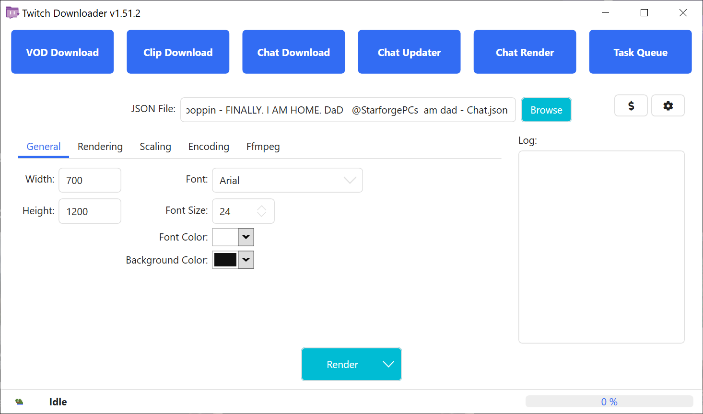
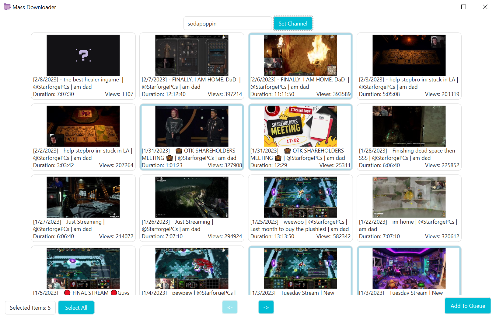

> [!WARNING]
> 英語版の TwitchDownloaderWPF README に日本語版の翻訳が追い付いていない場合があります。  
> 最新の Twitch DownloaderWPF README を確認したい場合は、[英語版](README.md)を確認してください。

# TwitchDownloaderWPF

TwitchDownloaderWPF は Windows のデスクトップアプリケーションで、様々な QoL 向上機能を有したコア機能を実装しています。

## 目次

- [TwitchDownloaderWPF](#twitchdownloaderwpf)
  - [目次](#目次)
  - [使用方法](#使用方法)
    - [アーカイブのダウンロード](#アーカイブのダウンロード)
    - [クリップダウンロード](#クリップダウンロード)
    - [チャットダウンロード](#チャットダウンロード)
    - [チャットの更新](#チャットの更新)
    - [チャットレンダリング](#チャットレンダリング)
      - [一般](#一般)
      - [レンダリング](#レンダリング)
      - [スケーリング](#スケーリング)
      - [エンコーディング](#エンコーディング)
      - [FFmpeg](#ffmpeg)
      - [レンダリング速度の最適化](#レンダリング速度の最適化)
    - [タスクキュー](#タスクキュー)
    - [設定](#設定)
  - [トラブルシューティング](#トラブルシューティング)
    - [エラー以外の問題](#エラー以外の問題)
    - [一般的なエラー](#一般的なエラー)
    - [一般的ではないエラー](#一般的ではないエラー)
  - [翻訳](#翻訳)
  - [テーマ](#テーマ)

---

## 使用方法

ほとんどのページでは、ウィンドウの左側に情報エリアがあり、サムネイル（ある場合）、配信者、作成日、アーカイブ/クリップのタイトルが表示され、ウィンドウの中央にはジョブの設定があり、ウィンドウの右側にはイベントのログを表示するエリアがあります。

### アーカイブのダウンロード

Twitch から配信のアーカイブやハイライトをダウンロードする。


<br><sup>*図 1.1*</sup>

はじめに、アーカイブまたはハイライトの有効なリンク、または ID を入力し、`取得`ボタンを押します。  
すると、ダウンロードオプションのロックが解除され、ジョブをカスタマイズできるようになります。  
アーカイブまたはハイライトが非公開、またはサブスクライバー限定の場合は、ビデオにアクセスできるアカウントの Oauth トークンが必要です。

**品質**: ダウンロードの品質を選択し、推定ファイルサイズを提供します。たまに、Twitchは一般的な解像度フォーマット（図 1.1の場合は1080p60）ではなく、最高画質を「Source」と呼ぶことがあります。

**トリミング**: ビデオのダウンロードの開始時間と終了時間を設定します。フォーマットは左から \[時間\] \[分\] \[秒\]。ビデオをトリミングすることで、ダウンロード総量が減少します。

**Download Threads**: 実行される並列ダウンロードスレッドの数

**OAuth**: サブスクライバー限定および非公開なアーカイブやハイライトのダウンロードをするための認証トークンです。有料コンテンツや非公開コンテンツの不正ダウンロードを防ぐため、このアプリケーションとTwitchが要求しています。Oauth トークンの取得方法は以下の動画（英語）を確認してください。[https://youtu.be/1MBsUoFGuls](https://www.youtube.com/watch?v=1MBsUoFGuls).  
<ins>**絶対にほかの誰かにあなたのトークンを共有しないでください**</ins>

**ダウンロード**: ダウンロードジョブを開始します。代わりにドロップダウンメニューを開くと、`ダウンロードをキューに追加`オプションで [タスクキュー](#タスクキュー)に送ることができます。どちらの方法でも、現在のダウンロード設定が使用されます。

### クリップダウンロード

Twitch からクリップをダウンロードする。


<br><sup>*図 2.1*</sup>

はじめに、クリップの有効なリンクまたは ID を入力し、`取得`ボタンを押します。  
すると、ダウンロードオプションのロックが解除され、ジョブをカスタマイズできるようになります。  

**品質**: ダウンロード前のクリップの品質を選択します。

**メタデータのエンコード**: 配信日時やクリップIDなどのクリップのメタデータを、FFmpeg を使って最終的な mp4 ファイルにエンコードします。

**ダウンロード**: ダウンロードジョブを開始します。代わりにドロップダウンメニューを開くと、`ダウンロードをキューに追加`オプションで [タスクキュー](#タスクキュー)に送ることができます。どちらの方法でも、現在のダウンロード設定が使用されます。

### チャットダウンロード

アーカイブ、ハイライト、クリップのチャットをダウンロードします。


<br><sup>図 3.1*</sup>


<br><sup>図 3.2*</sup>

はじめに、アーカイブ、ハイライト、クリップの有効なリンク、または ID を入力し、`取得`ボタンを押します。
すると、ダウンロードオプションのロックが解除され、ジョブをカスタマイズできるようになります。  
アーカイブやハイライトがサブスクライバー限定、または非公開の場合、チャットをダウンロードすることはできません。これは TwitchDownloader の制限ではなく、TwitchAPI の制限です。

**ダウンロードフォーマット**: ダウンロードしたチャットが保存されるファイルの形式。

- `JSON` はチャットの更新やレンダリングに使用できるチャットデータを出力します。
- `Text` はアーカイブを見ながらチャットを読むのに最適な生のテキストを出力します。
- `HTML` は Twitch ウェブサイトの外見を再現したローカルウェブページを出力します。

**圧縮** (JSON のみ): GZip 標準圧縮を使用して出力 JSON を圧縮し、ファイルサイズを 40~90 % 削減できます。[チャットの更新](#チャットの更新) を使用せずにチャットファイルの値を手動で変更する場合は推奨されません。

**タイムスタンプフォーマット** (Text のみ): テキストダウンロードのタイムスタンプ形式を変更する。 `UTC`（協定世界時） 、動画の開始位置からの相対的な時間の `Relative`、または `None` から選ぶ。

**トリミング**: ビデオのダウンロードの開始時間と終了時間を設定します。フォーマットは左から \[時間\] \[分\] \[秒\]。ビデオをトリミングすることで、ダウンロード総量が減少します。

**イメージを埋め込む** (JSON & HTML のみ): 配信者のスタンプとバッジをダウンロードし、ダウンロードしたチャット内に保存します。ファイルサイズはかなり大きくなります。

**サードパーティスタンプ** (JSON & HTML のみ): 指定されたサードパーティプロバイダからスタンプをダウンロードし、チャット内に保存します。配信者が指定されたプロバイダに登録していない場合は、スキップされます。

**Download Threads**: 実行される並列ダウンロードスレッドの数。インターネット接続によっては、Twitch サーバーが1つ以上のチャットダウンロードスレッドの使用を拒否する場合があります。

**ダウンロード**: ダウンロードジョブを開始します。代わりにドロップダウンメニューを開くと、`ダウンロードをキューに追加`オプションで [タスクキュー](#タスクキュー)に送ることができます。どちらの方法でも、現在のダウンロード設定が使用されます。

### チャットの更新

ダウンロードした JSON チャットの埋め込みスタンプ、バッジ、ビッツ、トリミングを更新したり、JSON チャットを別のフォーマットに変換したりできます。


<br><sup>図 4.1*</sup>

はじめに、**参照**ボタンをクリックし、以前にダウンロードした JSON チャットファイルを選択します。すると、更新オプションのロックが解除され、ジョブをカスタマイズすることができます。チャットの元のビデオがまだ存在する場合、その情報は情報セクションに読み込まれます。

**ダウンロードフォーマット**: ダウンロードしたチャットが保存されるファイルの形式。

- `JSON` はチャットの更新やレンダリングに使用できるチャットデータを出力します。
- `Text` はアーカイブを見ながらチャットを読むのに最適な生のテキストを出力します。
- `HTML` は Twitch ウェブサイトの外見を再現したローカルウェブページを出力します。

**圧縮** (JSON のみ): GZip 標準圧縮を使用して出力 JSON を圧縮し、ファイルサイズを 40~90 % 削減できます。[チャットの更新](#チャットの更新) を使用せずにチャットファイルの値を手動で変更する場合は推奨されません。

**タイムスタンプフォーマット** (Text のみ): テキストダウンロードのタイムスタンプ形式を変更する。 `UTC`（協定世界時） 、動画の開始位置からの相対的な時間の `Relative`、または `None` から選ぶ。

**トリミング**: 更新されたチャットをトリミングする開始時刻と終了時刻を設定します。フォーマットは左から \[時間\] \[分\] \[秒\]。チャットのトリミングを拡大すると、つまり現在の開始時刻よりも早く、現在の終了時刻よりも遅く設定すると、元々の JSON チャットに含まれていなかったコメントを取得しようとします。チャットのトリミングを縮小しても、コメントは削除されません。

**Embed Missing** (JSON & HTML のみ): JSON チャットに含まれていないスタンプまたはバッジをダウンロードします。既存のスタンプやバッジは上書きされません。

**埋め込みを置き換える** (JSON & HTML のみ): JSON チャットの既存のスタンプとバッジをすべて削除し、現在のスタンプとバッジをダウンロードします。

**サードパーティスタンプ** (JSON & HTML のみ): 指定されたサードパーティプロバイダからスタンプをダウンロードし、チャット内に保存します。配信者が指定されたプロバイダに登録していない場合は、スキップされます。

**更新**: 更新ジョブを開始します。代わりにドロップダウンメニューを開くと、`更新をキューに追加`オプションで [タスクキュー](#タスクキュー)に送ることができます。どちらの方法でも、現在の更新設定が使用されます。

### チャットレンダリング

チャットの JSON ファイルからビデオをレンダリングする。


<br><sup>図 5.1*</sup>


<br><sup>図 5.2*</sup>


<br><sup>図 5.3*</sup>


<br><sup>図 5.4*</sup>


<br><sup>図 5.5*</sup>


<br><sup>図 5.6*</sup>

はじめに、**参照**ボタンをクリックし、以前にダウンロードした JSON チャットファイルを選択します。すると、レンダリングオプションのロックが解除され、ジョブをカスタマイズすることができます。

**レンダリング**: レンダリングジョブを開始します。代わりにドロップダウンメニューを開くと、`レンダリングをキューに追加`オプションで [タスクキュー](#タスクキュー)に送ることができます。あるいは `部分レンダリング` オプションを選択することもできます。現在のレンダリング設定はすべてのシナリオで使用されます。

#### <ins>一般</ins>

**横幅**: 出力するチャットの横幅。偶数である必要があります。

**高さ**: 出力するチャットの高さ。偶数である必要があります。

**フォント**: 出力するチャットで使用されるフォント。Twitch のウェブサイトでは*Inter*を使用しており、*Inter Embedded* として TwitchDownloader に含まれています。

**フォントサイズ**: フォントの大きさ。

**フォントカラー**: メッセージのフォントカラー。

**バックグラウンドカラー**: 出力するチャットのバックグラウンドカラー

**代替バックグラウンドカラー**: 代替のバックグラウンドカラー。`代わりの背景` オプションが有効になっている必要があります。

#### <ins>レンダリング</ins>

**アウトライン**: ユーザー名とメッセージに細い黒の輪郭を追加します。

**タイムスタンプ**: チャットメッセージの横に、ビデオ開始からの相対的なタイムスタンプを描画します。

**サブスクライバーメッセージ**: サブスクライブ、再サブスクライブ、サブスクギフトの通知メッセージの描画。無効にするとレンダリングから除外されます。

**チャットバッジ**: ユーザー名の横にチャットバッジを描画します。

**Update Rate**: 次のコメントのバッチを描画するまでの時間（秒）。数値を小さくするとチャットの流れが読みやすくなりますが、レンダリング時間がわずかに長くなります。

**分散**: 2022年11月にTwitch APIが変更され、チャットメッセージのダウンロードが秒単位になりました。このオプションでは、追加のメタデータを使用して、メッセージが実際に送信された時刻に復元しようとします。その結果、コメントの順序が異なる場合があります。効果的な結果を得るには、更新レートが1.0未満である必要があります。

**代わりのバックグラウンド**: 他のチャットメッセージの背景色を交互に表示し、見分けやすくします。

**BTTV スタンプ**: BTTV からのスタンプを描画に含みます。

**FFZ スタンプ**: FFZ からのスタンプを描画に含みます。

**7TV スタンプ**: 7TV からのスタンプを描画に含みます。

**オフライン**: ネットワークリクエストを一切行わず、JSON チャットに埋め込まれた情報と画像のみを使用してレンダリングを行います。

**チャットバッジフィルター**: 指定されたバッジをレンダリングしません。例えば、図 5.2 の場合 `音声のみ` バッジと `音声なしで視聴中` バッジはレンダリングされません。

**無視するユーザーのリスト**: レアだリングから削除するユーザーを、カンマ区切りで大文字と小文字を区別せずに指定します。例えば、図 5.2 では StreamLabs, StreamElements, Nightbot がレンダリングから削除されます。

**BAN されたワード**: カンマで区切られた、大文字と小文字を区別しない単語のリスト。例えば、図5.2では `" pog"`, `"[pOg+"`, `"/POg9"` を含むメッセージはレンダーから削除されます。`"poggers"` を含むメッセージは削除されません。。

**Emojiベンダー**: レンダリングで使用する絵文字のスタイル。現在、Twitter の `Twemoji`、Google の `Noto Color`、システムの絵文字（`None`）がサポートされています。

#### <ins>スケーリング</ins>

**Emote Scale**: The scale of emotes.

**Badge Scale**: The scale of badges.

**Emoji Scale**: 絵文字のスケール。

**Vertical Spacing Scale**: メッセージ間の空白のスケール。

**Side Padding Scale**: 水平方向のの空白のスケール。

**Section Height Scale**: テキスト行の高さのスケール。

**Word Spacing Scale**: 単語間の空白のスケール。

**Emote Spacing Scale**: スタンプと他のスタンプ、または単語の間の空白のスケール。

**Highlight Stroke Scale**: 強調表示、サブスクライブメッセージのサイドバーの幅スケール。

**Highlight Indent Scale**: 強調表示、サブスクライブメッセージのインデントのスケール。

#### <ins>エンコーディング</ins>

**ファイルフォーマット**: 出力するファイル形式。

**コーデック**: 出力に使用するコーデック。

**フレームレート**: 出力されるビデオのフレームレート。

**マスクを生成**: レンダリング中のテキストと画像の白黒マスクを含む二次出力ファイルを生成する。背景色のアルファチャンネルは255未満でなければならない。

**Sharpening**: レンダリングされたビデオにシャープニングフィルタを適用します。レンダリング時間とファイルサイズがわずかに増加します。`ファントサイズ` 24 以上で最適です。

#### <ins>FFmpeg</ins>

**警告: FFmpeg の引数を変更するとパイプエラーが発生する場合があります。**

**入力引数**: FFmpegへのレンダリング入力を制御するための引数。

**出力引数**: FFmpegからのエンコード出力を制御するための引数。

**デフォルトにリセット**: FFmpeg の引数の両方をデフォルトにリセットします。

#### <ins>レンダリング速度の最適化</ins>

レンダリング速度が遅すぎると感じたら、以下のいずれかを試してみてください:

| 大きな影響                   | 中程度の影響                    | 小さな影響                                    |
|------------------------------|---------------------------------|-----------------------------------------------|
| レンダリング幅を減らす       | BTTV、FFZ、7TVスタンプを無効にする | Update Rateが1.0以下の場合、分散を無効にする  |
| レンダリング高さを減らす     | Update Rateを増やす             | サブスクライブメッセージを無効にする          |
| フレームレートを減らす       | システム絵文字に変更する        | アウトラインを無効にする                      |
| マスク生成を無効にする       |                                 | 代わりの背景を無効にする                      |
| Sharpeningを無効にする       |                                 |                                               |
| コーデックをH.264に変更する  |                                 |                                               |

### タスクキュー

複数のジョブを作成し、管理する。


<br><sup>図 6.1*</sup>


<br><sup>図 6.2*</sup>


<br><sup>図 6.3*</sup>


<br><sup>図 6.4*</sup>


<br><sup>図 6.5*</sup>

タスクキューは、多くのジョブを順次または並行して実行することを可能にします。他の5つのページのどのジョブも、それぞれの `XXXをキューに追加` ボタンを使ってタスクキューに送ることができます。（図 6.5 参照）

タスクキューのページには、4つの制限があります。:

**アーカイブのダウンロード**: 同時に行えるアーカイブ/ハイライト のダウンロードジョブ数。

**クリップダウンロード**: 同時に行える クリップ のダウンロードジョブ数。

**チャットダウンロード**: 同時に行える チャット のダウンロードジョブ数。

**チャットレンダリング**: 同時に行える チャット のレンダリングジョブ数。

タスクキューには3種類の大量ダウンロード機能があります:

**URLリスト**: 全て同じ設定で処理されるアーカイブ、ハイライト、クリップのURLリスト。図 6.2 および 図 6.5 参照。

**アーカイブを検索**: 同じ設定で処理される配信者からの全アーカイブを検索するウィンドウ。図 6.3 および 図 6.5 参照。

**クリップを検索**: 同じ設定で処理される配信者の全クリップを検索するウィンドウ。図 6.3 および 図 6.5 参照。

### 設定

アプリケーションの動作を管理します。


<br><sup>図 7.1*</sup>

**キャッシュフォルダ**: 一時的な作業ファイルが保存されるフォルダ。これにはアーカイブダウンロード、スタンプ、バッジ、ビッツが含まれます。

- **クリア**: TwitchDownloader 関連のキャッシュファイルをすべて削除します。アプリケーションが正しく動作していない場合をのぞき、お勧めしません。
- **参照**: 一時キャッシュを保存するフォルダを選択します。既存のキャッシュファイルは転送されません。

**寄付ボタンを非表示**: 寄付ボタンを非表示にする。

**詳細なエラー**: エラー発生時の説明ポップアップを有効にする。

**テーマ**: アプリケーションのテーマ。[テーマセクション](#テーマ) を参照。

**言語**: アプリケーションの言語。 [翻訳セクション](#翻訳) を参照。

**最大スレッド帯域幅**: 新しいダウンロードスレッドが使用を許可される最大帯域幅を1秒当たりのキロバイト数（KiB/s）で指定する。

**ダウンロードファイルの名前テンプレート**: ダウンロード時にデフォルトのファイル名を生成するためのテンプレート。

## トラブルシューティング

### エラー以外の問題

エラーとはみなされない問題もあります。これらは[GitHub Issue](https://github.com/lay295/TwitchDownloader/issues)として、問題の原因となった入力とともに報告する必要があります。エラーではない問題の例をいくつか挙げます：

- 動画のダウンロードが`Downloading： 99%` が 5 分以上続く
- チャットレンダリングのステータスが10秒以上更新されない
- チャットのレンダリングでコメントが表示されない
- アプリケーションのテーマを変更してもUI要素が反応しない
- スタンプの埋め込みなどのオプションを変更しても効果がない

### 一般的なエラー

エラーは、ジョブの開始前または開始直後に発生した場合、「一般的な」エラーとみなされます。一般的なエラーには、何が問題であったかを説明する親切なエラーメッセージが表示されます。一般的なエラーの例としては、以下のようなものがあります：

- サムネイルが見つかりません
  - アーカイブの有効期限が切れているか、現在ライブ中です。
- ビデオ/クリップ情報が取得できません
  - リンク先のアーカイブ/Clipが無効であるか、削除されているか、プライベート/サブ専用で有効なOAuthが提供されていません。
- 入力を解析できませんでした
  - 1つ以上のレンダー入力が無効です。

### 一般的ではないエラー

一般的でないエラーは、"Fatal Error"というタイトルのポップアップや、不親切なエラーメッセージによって特徴付けられます。これらのエラーは、[GitHub Issue](https://github.com/lay295/TwitchDownloader/issues)として、エラーの原因となった入力とともに報告する必要があります。一般的でないエラーの例としては、以下のようなものがあります：

- Error converting value 'XXX' to type 'XXX'. Path 'XXX', line #, position #.
- Cannot access child value on Newtonsoft.Json.Linq.JValue.
- Response status code does not indicate success: 404 (Not Found).
- The pipe has been ended.
  - FFmpegで問題が発生しました。引数をデフォルトにリセットして再試行してください。それでも成功しない場合は、GitHubに新しいIssueを作成してください。

エラーの原因を突き止めるために、[設定](#設定)で`詳細なエラー`を有効にして、"Verbose Error Output "というタイトルのポップアップのスクリーンキャプチャを取ってください。

## 翻訳

このアプリケーションは、翻訳を申し出てくれる寛大なコミュニティのメンバーのおかげで、多言語で利用できます。

もしあなたが翻訳を作成する能力に自信があり、TwitchDownloaderWPF があなたの母国語で利用できない場合、またはあなたの母国語の翻訳が不完全な場合、あなたの助けを歓迎します！

もし始めるにあたってサポートが必要であれば、コミット [53245be1fe55768d525905e81cc2cd0c12469b03](https://github.com/lay295/TwitchDownloader/commit/53245be1fe55768d525905e81cc2cd0c12469b03) を確認するか、[AvailableCultures.cs](Services/AvailableCultures.cs) を確認するか、オリジナルの [localization thread](https://github.com/lay295/TwitchDownloader/issues/445) を確認するか、[GitHubIssueを作成して](https://github.com/lay295/TwitchDownloader/issues/new/choose) サポートを求めてみてください。（サポートやスレッドは基本的に英語です）

文字列や文字列の一部をどのように翻訳したらよいかわからない場合は、英語のままでも構いません。

## テーマ

ライトテーマとダークテーマの両方がアプリケーションに含まれており、現在のWindowsアプリのテーマに基づいて自動的に2つを切り替えるオプションもあります。現在、ライトテーマとダークテーマは、常に最新であることを保証するために、実行するたびに上書きされます。

自分のテーマを作り始めるには、同梱されているテーマを複製して、お好きなテキストエディタで開くだけです。

WPFアプリケーションでは、_HandyControl_と呼ばれるパッケージの要素をいくつか使用していますが、これらは完全なテーマ化サポートを提供していません。ほとんどのHandyControl要素はテキストとボーダーの再カラーリングのみをサポートしています。これを制御するには、`DarkHandyControl`真偽値キーをtrueまたはfalseに設定します。

あなたのテーマで暗いタイトルバーを有効にするには、`DarkTitleBar`真偽値キーをtrueに設定します。

残りの `SolidColorBrush` キーは、アプリの背景色、テキスト色、ボーダー色など、アプリとアプリの要素の色を制御します。Inner'キーは、以下の図に見られるように、再帰的な要素に深さを追加するために使用されます：

```
/---------------------------[-][#][x]
|           AppBackground           |
| /-------------------------------\ |
| |     AppElementBackground      | |
| | /---------------------------\ | |
| | | AppInnerElementBackground | | |
| | |                           | | |
| | \---------------------------/ | |
| |                               | |
| \-------------------------------/ |
|                                   |
\-----------------------------------/
```

この場合、`AppElementBackground`はフレームで使用され、`AppInnerElementBackground`はボーダーラベルや空白の画像背景などで使用されます。

**重要な注意事項**

- アプリケーションを起動すると、`Dark.xaml` と `Light.xaml` は常に上書きされます。
- ファイル名は大文字と小文字を区別せずに読み込まれるため、`Dark.xaml`と`dark.xaml`を区別することはできません。
- テーマファイルの一番上にある作者コメントを編集することを忘れないでください！
- あなたのテーマをプログラムに含めることができます！自分の TwitchDownloader のフォークにアップロードして、[プルリクエストを作成](https://github.com/lay295/TwitchDownloader/pulls)してください。

カスタムテーマの作成に関するオフラインの手順については、`Themes/README.txt` を参照してください。このファイルは、実行のたびに再生成されます。
