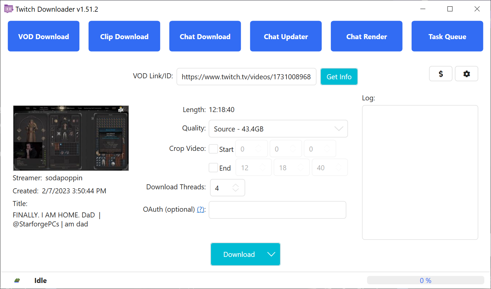
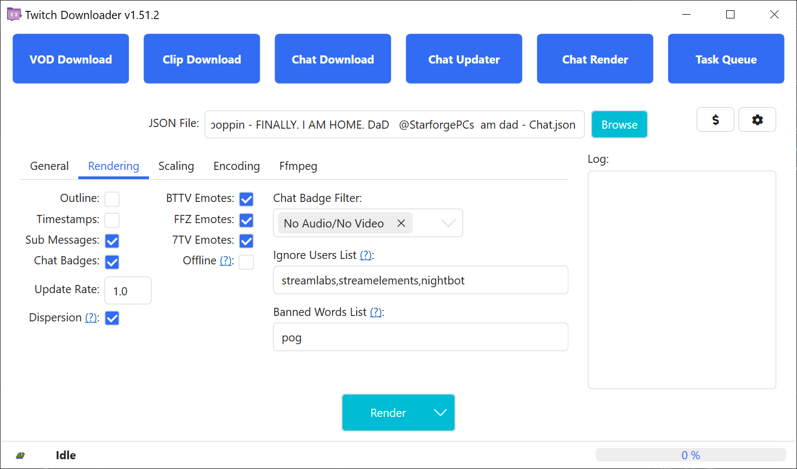
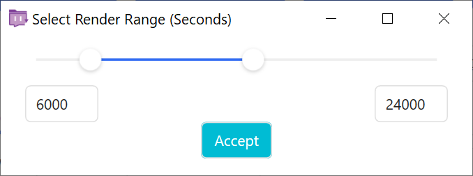
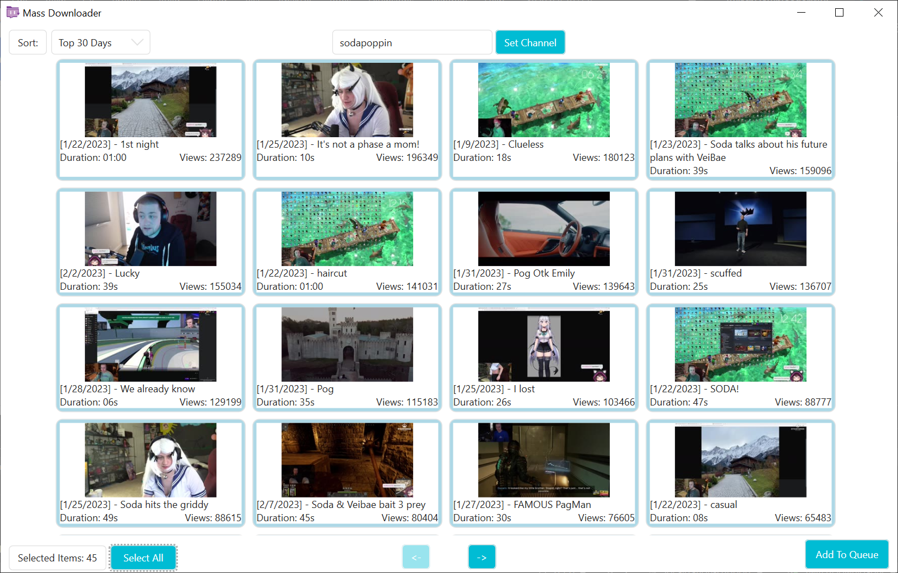
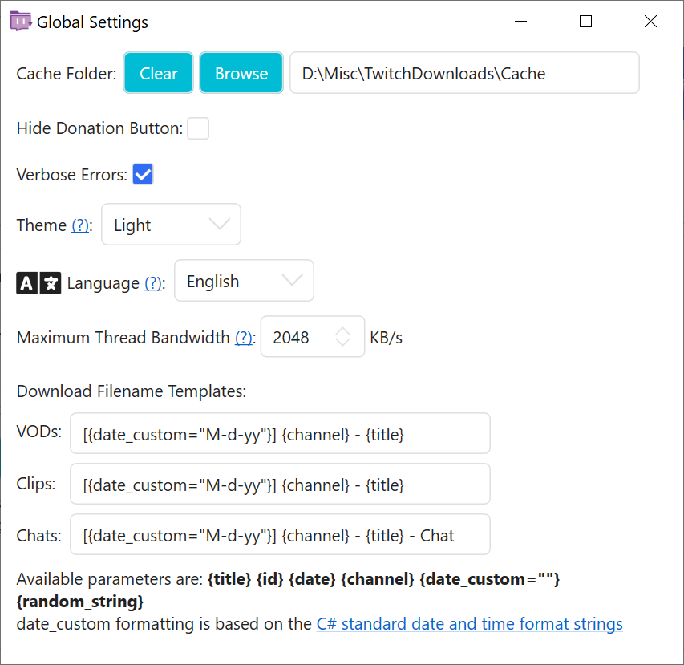

> [!WARNING]
> A tradução em português do README de TwitchDownloaderWPF pode estar desatualizada.
> Caso deseja checar a versão mais recente, por favor, refira ao README em [Inglês](README.md).

# TwitchDownloaderWPF

Um aplicativo desktop Windows WPF que implementa a funcionalidade principal envolvida em vários recursos de qualidade de vida.

## Sumário

- [TwitchDownloaderWPF](#twitchdownloaderwpf)
  - [Sumário](#sumário)
  - [Uso](#uso)
    - [Download de VOD](#download-de-vod)
    - [Download de Clipe](#download-de-clipe)
    - [Download de Chat](#download-de-chat)
    - [Atualizador de Chat](#atualizador-de-chat)
    - [Renderização de Chat](#renderização-de-chat)
      - [Geral](#geral)
      - [Renderização](#renderização)
      - [Escala](#escala)
      - [Codificação](#codificação)
      - [FFmpeg](#ffmpeg)
      - [Otimização da Velocidade de Renderização](#otimização-da-velocidade-de-renderização)
    - [Fila de Tarefas](#fila-de-tarefas)
    - [Configurações](#configurações)
  - [Solução de Problemas](#solução-de-problemas)
    - [Problemas Sem Erros](#problemas-sem-erros)
    - [Erros Comuns](#erros-comuns)
    - [Erros Raros](#erros-raros)
  - [Localização](#localização)
  - [Temas](#temas)

## Uso

A maioria das páginas contém uma área de informações no lado esquerdo da janela, exibindo a thumbnail (se disponível), o streamer, a data de criação e o título do VOD/clipe. O centro da janela contém as configurações para o trabalho, e o lado direito da janela contém uma área para registrar eventos.

### Download de VOD

Baixa um VOD ou highlight de uma stream da Twitch.


<br><sup>*Figura 1.1*</sup>

Para começar, insira um link ou ID válido de um VOD ou highlight. Se o VOD ou highlight for privado ou exclusivo para inscritos, será necessário um token OAuth de uma conta com acesso ao vídeo. A partir daí, as opções de download serão desbloqueadas, permitindo personalizar o trabalho.

**Qualidade**: Seleciona a qualidade do download e fornece uma estimativa do tamanho do arquivo. Ocasionalmente, o Twitch chama a qualidade mais alta de "Fonte" em vez da formatação típica de resolução (1080p60 no caso da figura 1.1).

**Modo de corte**: Define o manuseio do corte de vídeo. Vídeos cortados com corte exato podem, raramente, apresentar engasgos de vídeo/áudio nos primeiros/últimos segundos. O corte seguro garante que não haverá engasgos, mas pode resultar em um vídeo ligeiramente mais longo.

**Corte**: Define o horário de início e fim para cortar o vídeo no formato \[horas\] \[minutos\] \[segundos\]. Cortar o vídeo resultará em um download total menor.

**Threads de Download**: A quantidade de threads de download paralelas a serem enviadas.

**OAuth**: O token de autorização para permitir o download de VODs ou highlights exclusivos para assinantes e privados. Ele é necessário por nós e pela Twitch para evitar downloads não autorizados de conteúdo pago ou privado. Aprenda como obter seu token OAuth no vídeo a seguir: [https://youtu.be/1MBsUoFGuls](https://www.youtube.com/watch?v=1MBsUoFGuls). <ins>**NÃO COMPARTILHE SEU TOKEN OAUTH COM NINGUÉM.**</ins>

**Download**: Inicia o trabalho de download. Se, em vez disso, você abrir o menu suspenso, pode enviá-lo para a [Fila de Tarefas](#fila-de-tarefas) com a opção Adicionar à fila. As configurações de download atuais serão usadas em ambos os cenários.

### Download de Clipe

Baixa um clipe da Twitch.


<br><sup>*Figura 2.1*</sup>

Para começar, insira um link ou ID válido de um clipe. A partir daí, as opções de download serão desbloqueadas, permitindo personalizar o trabalho.

**Qualidade**: Seleciona a qualidade do clipe antes de baixar.

**Codificar Metadados**: Codifica os metadados do clipe, como a data de exibição e o ID do clipe, no arquivo final em mp4 usando o FFmpeg.

**Download**: Inicia o trabalho de download. Se, em vez disso, você abrir o menu suspenso, pode enviá-lo para a [Fila de Tarefas](#fila-de-tarefas) com a opção Adicionar à fila. As configurações de download atuais serão usadas em ambos os cenários.

### Download de Chat

Baixa o chat de um VOD, highlight, ou clipe.


<br><sup>*Figura 3.1*</sup>


<br><sup>*Figura 3.2*</sup>

Para começar, insira um link ou ID válido de um VOD, highlight ou clipe. A partir daí, as opções de download serão desbloqueadas, permitindo personalizar o trabalho. Se o VOD ou highlight for exclusivo para assinantes ou privado, não será possível baixar o chat. Esta é uma limitação da API da Twitch, não do TwitchDownloader.

**Formato de Download**: O formato de arquivo em que o chat baixado será salvo.

- `JSON` gera uma versão específica do chat, que pode ser usada para atualização e renderização.
- `Texto` gera uma versão em texto puro do chat, ideal para ler enquanto assiste a um VOD.
- `HTML` gera uma página local que emula a aparência do site da Twitch.

**Compressão** (Somente JSON): Comprime o JSON de saída usando o padrão de compressão GZip, permitindo uma redução de tamanho de arquivo de 40-90%. Não recomendado se você deseja editar manualmente os valores no arquivo de chat sem usar o [Atualizador de Chat](#atualizador-de-chat).

**Formato de Timestamp** (Somente Texto): Altera o formato de timestamp no download de texto. As opções são `UTC`, `Relativo`ao início do vídeo, e `Nenhum`.

**Corte**: Define o tempo de início e fim para cortar o download do chat no formato \[horas\] \[minutos\] \[segundos\]. Cortar o chat resultará em um download total menor.  

**Incorporar Imagens** (*Apenas JSON & HTML*): Baixa os emotes e badges do streamer e os salva dentro do chat baixado. O tamanho do arquivo será muito maior.  

**Emotes de Terceiros** (*Apenas JSON & HTML*): Também baixa emotes de provedores de terceiros especificados e os salva dentro do chat. Se o streamer não estiver registrado em um determinado provedor, ele será ignorado.  

**Threads de Download**: A quantidade de threads paralelas de download a serem executadas. Em algumas conexões de internet, os servidores da Twitch podem recusar o uso de mais de 1 thread de download de chat.  

**Download**: Inicia o trabalho de download. Se, em vez disso, você abrir o menu suspenso, pode enviá-lo para a [Fila de Tarefas](#task-queue) com a opção *Adicionar à fila*. As configurações de download atuais serão usadas em ambos os cenários.

### Atualizador de Chat  

Atualiza os emotes incorporados, badges, bits e cortes de um chat JSON baixado e/ou converte um chat JSON para outro formato.  

  
<br><sup>*Figura 4.1*</sup>  

Para começar, clique no botão **Procurar** e selecione um chat JSON baixado anteriormente. A partir daí, as opções de atualização serão desbloqueadas, permitindo que você personalize a tarefa. Se o vídeo original do chat ainda existir, suas informações serão carregadas na seção de informações.

**Formato de Download**: O formato de arquivo em que o chat baixado será salvo.

- `JSON` gera uma versão específica do chat, que pode ser usada para atualização e renderização.
- `Texto` gera uma versão em texto puro do chat, ideal para ler enquanto assiste a um VOD.
- `HTML` gera uma página local que emula a aparência do site da Twitch.

**Compressão** (Apenas JSON): Comprime o JSON de saída usando o padrão de compactação GZip, permitindo uma redução de 40-90% no tamanho do arquivo. Não recomendado se você quiser editar manualmente os valores no arquivo de chat sem usar o [Atualizador de Chat](#chat-updater).  

**Formato de Timestamp** (Apenas Texto): Altera o formato do timestamp no chat de texto. As opções são `UTC`, `Relativo` ao início do vídeo e `Nenhum`.  

**Corte**: Define o tempo de início e fim para cortar o chat atualizado no formato \[horas\] \[minutos\] \[segundos\]. Expandir o corte de um chat fará com que o atualizador tente buscar comentários que não foram incluídos originalmente no download. Reduzir o corte de um chat **não** removerá comentários.  

**Incorporar Ausentes** (Apenas JSON & HTML): Baixa quaisquer emotes ou badges que não foram originalmente incluídos no chat JSON de entrada. Emotes ou badges já existentes NÃO serão sobrescritos.  

**Substituir Incorporados** (Apenas JSON & HTML): Descarta todos os emotes e badges existentes do chat JSON de entrada e baixa os emotes e badges atuais.  

**Emotes de Terceiros** (Apenas JSON & HTML): Também baixa emotes de provedores de terceiros especificados e os salva dentro do chat. Se o streamer não estiver registrado em um determinado provedor, ele será ignorado.  

**Atualizar**: Inicia a tarefa de atualização. Se, em vez disso, você abrir o menu suspenso, pode enviá-lo para a [Fila de Tarefas](#task-queue) com a opção *Adicionar à fila*. As configurações atuais de atualização serão usadas em ambos os cenários.  

### Renderização de Chat

Renderiza um chat JSON como um vídeo.  

  
<br><sup>*Figura 5.1*</sup>  

  
<br><sup>*Figura 5.2*</sup>  

  
<br><sup>*Figura 5.3*</sup>  

  
<br><sup>*Figura 5.4*</sup>  

  
<br><sup>*Figura 5.5*</sup>  

  
<br><sup>*Figura 5.6*</sup>  

Para começar, clique no botão **Procurar** e selecione um chat JSON baixado anteriormente. A partir daí, você pode editar as opções de renderização para personalizar a tarefa.  

**Renderizar**: Inicia a tarefa de renderização. Se, em vez disso, você abrir o menu suspenso, pode enviá-la para a [Fila de Tarefas](#task-queue) com a opção *Adicionar à fila*. Alternativamente, você também pode selecionar a opção *Renderização Parcial* para renderizar uma seção menor do chat (veja a Figura 5.6). As configurações atuais de renderização serão usadas em todos os cenários.

#### <ins>Geral</ins>

**Largura**: A largura da renderização do chat. Deve ser um número par.  

**Altura**: A altura da renderização do chat. Deve ser um número par.  

**Fonte**: A fonte usada na renderização do chat. O site da Twitch usa *Inter*, que está incluída no TwitchDownloader como *Inter Embedded*.  

**Tamanho da Fonte**: O tamanho da fonte.  

**Cor da Fonte**: A cor da fonte das mensagens.  

**Cor de Fundo**: A cor de fundo da renderização do chat.  

**Cor de Fundo Alternativa**: A cor de fundo alternativa das mensagens. Requer que *Fundos Alternativos* esteja ativado.  

#### <ins>Renderização</ins>  

**Contorno**: Adiciona um contorno preto fino aos nomes de usuário e mensagens.  

**Timestamps**: Exibe um timestamp relativo ao início do vídeo ao lado das mensagens do chat.  

**Mensagens de Sub**: Exibe mensagens de inscrição, renovação de inscrição e presentes de inscrição. Se desativado, essas mensagens serão filtradas da renderização.  

**Badges do Chat**: Exibe badges do chat ao lado dos nomes de usuário.  

**Taxa de Atualização**: O intervalo de tempo (em segundos) entre a exibição de novos lotes de mensagens. Números menores tornam o fluxo do chat mais legível, mas aumentam marginalmente o tempo de renderização.  

**Dispersão**: Desde novembro de 2022, uma mudança na API da Twitch faz com que mensagens do chat sejam baixadas apenas em segundos inteiros. Esta opção usa metadados adicionais para tentar restaurar as mensagens ao momento exato em que foram enviadas. Isso pode resultar em uma ordem diferente de comentários. Requer uma taxa de atualização menor que 1.0 para resultados eficazes.  

**Fundos Alternativos**: Alterna a cor de fundo de cada mensagem do chat para ajudar a diferenciá-las.  

**Aumentar Visibilidade de Nome de Usuários**: Aumenta o contraste entre os nomes de usuário e o fundo, semelhante à opção _Readable Colors_ do chat da Twitch. Se os contornos estiverem ativados, esta opção aumenta o contraste do nome de usuário contra o contorno em vez do fundo.  

**Emotes BTTV**: Habilita emotes do BTTV na renderização.  

**Emotes FFZ**: Habilita emotes do FFZ na renderização.  

**Emotes 7TV**: Habilita emotes do 7TV na renderização.  

**Offline**: Renderiza sem fazer nenhuma solicitação de rede, usando apenas as informações e imagens incorporadas no JSON do chat.  

**Filtro de Badges do Chat**: Impede a renderização dos badges especificados. Por exemplo, na Figura 5.2, os badges *Sem Áudio* ou *Sem Vídeo* não serão renderizados.  

**Lista de Usuários Ignorados**: Uma lista separada por vírgulas e sem distinção entre maiúsculas e minúsculas de usuários a serem removidos da renderização. Por exemplo, na Figura 5.2, *Streamlabs*, *StreamElements* e *Nightbot* serão removidos da renderização.  

**Lista de Palavras Banidas**: Uma lista separada por vírgulas e sem distinção entre maiúsculas e minúsculas de palavras que farão com que mensagens sejam removidas da renderização. Por exemplo, na Figura 5.2, qualquer mensagem que contenha `" pog "`, `"[pOg+"`, `"/POg9"` será removida da renderização. No entanto, qualquer mensagem contendo `" poggers "` não será removida.  

**Fornecedor de Emojis**: O estilo de emojis usados na renderização. Atualmente, são suportados os _Twemoji_ do Twitter, _Noto Color_ do Google e os emojis do seu sistema (_Nenhum_).

#### <ins>Escala</ins>

**Escala de Emotes**: Define a escala dos emotes.  

**Escala de Badges**: Define a escala dos badges.  

**Escala de Emojis**: Define a escala dos emojis.  

**Escala de Contorno**: Define a espessura dos contornos na renderização.  

**Escala de Espaçamento Vertical**: Define a escala do espaço entre mensagens.  

**Escala de Padding Lateral**: Define a escala do padding horizontal.  

**Escala da Altura da Seção**: Define a escala da altura de uma linha de texto.  

**Escala de Espaçamento entre Palavras**: Define a escala do espaço entre palavras.  

**Escala de Espaçamento de Emotes**: Define a escala do padding entre emotes e outros emotes ou palavras.  

**Escala da Largura do Highlight**: Define a escala da largura da barra lateral de mensagens destacadas/subs.  

**Escala da Identação do Highlight**: Define a escala do recuo de mensagens destacadas/subs.  

#### <ins>Codificação</ins>

**Formato de Arquivo**: Define o formato do arquivo da renderização final.  

**Codec**: Define o codec utilizado na renderização final.  

**Taxa de Quadros**: Define a taxa de quadros da renderização final.  

**Gerar Máscara**: Gera um arquivo secundário contendo uma máscara preto e branco do texto e imagens na renderização. O canal alfa da cor de fundo deve ser menor que 255.  

**Nitidez**: Aplica um filtro de nitidez ao vídeo renderizado. Aumenta ligeiramente o tempo de renderização e o tamanho do arquivo. Funciona melhor com *Tamanho da Fonte* 24 ou maior.

#### <ins>FFmpeg</ins>

**Aviso: modificar os argumentos do FFmpeg pode causar erros de processamento!**  

**Argumentos de Entrada**: Argumentos para controlar a entrada renderizada para o FFmpeg.  

**Argumentos de Saída**: Argumentos para controlar a saída codificada do FFmpeg.  

**Redefinir para Padrões**: Restaura os argumentos do FFmpeg para os valores padrão.

#### <ins>Otimização da Velocidade de Renderização</ins>

Se a renderização estiver muito lenta, tente as seguintes opções:

| Grande Impacto          | Impacto Médio                  | Pequeno Impacto                           |
|-------------------------|--------------------------------|-------------------------------------------|
| Reduzir a largura da renderização | Desativar emotes BTTV, FFZ e 7TV | Desativar dispersão se a taxa de atualização for <1.0 |
| Reduzir a altura da renderização  | Aumentar a taxa de atualização  | Desativar mensagens de inscrição |
| Reduzir a taxa de quadros (framerate) | Usar emojis do sistema         | Desativar contornos |
| Desativar geração de máscara |                                | Desativar fundos alternados |
| Desativar nitidez da imagem |                                | |
| Alterar codec para H.264 |                                | |

### Fila de Tarefas

Crie e gerencie múltiplas tarefas.


<br><sup>*Figura 6.1*</sup>


<br><sup>*Figura 6.2*</sup>


<br><sup>*Figura 6.3*</sup>


<br><sup>*Figura 6.4*</sup>


<br><sup>*Figura 6.5*</sup>

A Fila de Tarefas permite processar vários trabalhos de forma sequencial ou paralela. Qualquer tarefa das outras cinco páginas pode ser enviada para a Fila de Tarefas através do botão *Enqueue*, conforme mostrado na Figura 6.5.

Na página da Fila de Tarefa*, existem quatro limitadores:

**Downloads de VODs**: Número máximo de downloads simultâneos de VODs/highlights.  
**Downloads de Clipes**: Número máximo de downloads simultâneos de clipes.  
**Downloads de Chat**: Número máximo de downloads/atualizações simultâneos de chat.  
**Renderizações de Chat**: Número máximo de renderizações simultâneas de chat.  

A Fila de Tarefas também permite três tipos de downloads em massa:

**Lista de URLs**: Uma lista de URLs de VODs, highlights ou clipes, todos processados com as mesmas configurações. (Ver Figuras 6.2 e 6.5.)  
**Buscar VODs**: Pesquisa todos os VODs de um streamer para processamento com as mesmas configurações. (Ver Figuras 6.3 e 6.5.)  
**Buscar Clipes**: Pesquisa todos os clipes de um streamer para processamento com as mesmas configurações. (Ver Figuras 6.4 e 6.5.)  

### Configurações

Gerencie o comportamento do aplicativo.


<br><sup>*Figura 7.1*</sup>

**Pasta de Cache**: O diretório onde os arquivos temporários são armazenados. Isso inclui downloads de VODs, emotes, badges e cheermotes.  

- **Limpar**: Exclui todos os arquivos de cache relacionados ao TwitchDownloader. Não recomendado, a menos que o aplicativo não esteja funcionando corretamente.  
- **Navegar**: Permite selecionar uma nova pasta para armazenar o cache temporário. Os arquivos existentes não serão transferidos.  

- **Ocultar Botão de Doação**: Oculta o botão de doação.  

- **Formato de Hora**: Define como o tempo será exibido na interface e nos nomes dos arquivos baixados.  

- **Erros Detalhados**: Habilita pop-ups com descrições detalhadas quando um erro ocorre.  

- **Tema**: Define o tema do aplicativo. Consulte [Temas](#temas) para mais detalhes.  

- **Idioma**: Define o idioma do aplicativo. Consulte [Localização](#localização) para mais detalhes.  

- **Largura de Banda Máxima por Thread**: Define a largura de banda máxima (em KiB/s) permitida para novas threads de download.  

- **Níveis de Log**: Ativa diferentes níveis de registro para facilitar a depuração.

- **Modelos de Nome de Arquivo para Download**: Modelos usados para gerar nomes padrão para os arquivos baixados.  

- **Restaurar Padrões**: Restaura os valores padrão de todas as configurações, incluindo as memorizadas em cada página. Requer reinício do aplicativo para aplicar as alterações.

- **Salvar**: Salva as alterações feitas e fecha a janela de configurações.  

- **Cancelar**: Descarta as alterações feitas e fecha a janela de configurações.  

## Solução de Problemas

### Problemas Sem Erros

Alguns problemas podem não ser consideradas como erro. Eles devem ser reportados como um [issue no GitHub](https://github.com/lay295/TwitchDownloader/issues), juntamente com os detalhes da entrada que causou o problema. Exemplos:  

- O download de um vídeo fica travado em `Downloading: 99%` por mais de 5 minutos.  
- A renderização do chat não atualiza o status por mais de 10 segundos.  
- Mensagens do chat ausentes na renderização.  
- Um elemento da interface não responde à mudança de tema do aplicativo.  
- Alterar uma opção (como incorporar emotes) não tem efeito.  

### Erros Comuns

Um erro pode ser considerado "comum" se ocorrer antes de iniciar um trabalho ou imediatamente após o início de um trabalho. Um erro comum geralmente exibe uma mensagem amigável, muitas vezes acompanhada de um pop-up explicando o que deu errado. Alguns exemplos de erros comuns incluem:

- Impossível encontrar a miniatura**  
  - O VOD está expirado ou está ao vivo no momento.
- Impossível obter informações do vídeo/clipe**  
  - O VOD/clip vinculado é inválido, foi removido, ou é privado/sub-only e nenhum OAuth válido foi fornecido.
- Impossível analisar entradas**  
  - Uma ou mais entradas de renderização são inválidas, consulte o log.

### Erros Raros

Um erro raro pode ser identificado por um pop-up com o título "Erro Fatal" ou uma mensagem de erro pouco amigável. Esses erros devem ser reportados como um [issue no GitHub](https://github.com/lay295/TwitchDownloader/issues), juntamente com os detalhes da entrada que causou o erro. Alguns exemplos de erros raros incluem:

- Erro ao converter valor 'XXX' para o tipo 'XXX'. Caminho 'XXX', linha #, posição #.
- Não é possível acessar o valor filho em Newtonsoft.Json.Linq.JValue.
- Código de status da resposta não indica sucesso: 404 (Não Encontrado).
- O pipe foi finalizado.
  - Ocorreu um problema com o FFmpeg. Redefina os argumentos para os valores padrão e tente novamente. Se o problema persistir, crie um novo issue no GitHub.

Para ajudar a identificar a origem de um erro, ative os `Erros Detalhados` nas [configurações](#configurações) e faça uma captura de tela do pop-up resultante intitulado "Verbose Error Output".

## Localização

O aplicativo WPF está disponível em vários idiomas, graças a membros generosos da comunidade que ajudaram a traduzi-lo.

Se você tem confiança em sua capacidade de criar uma tradução e o TwitchDownloaderWPF não está disponível no seu idioma nativo ou a tradução está incompleta, você pode ajudar!  

Se precisar de ajuda para começar, revise o commit [53245be1fe55768d525905e81cc2cd0c12469b03](https://github.com/lay295/TwitchDownloader/commit/53245be1fe55768d525905e81cc2cd0c12469b03), consulte o [AvailableCultures.cs](Services/AvailableCultures.cs), leia o tópico original [de localização](https://github.com/lay295/TwitchDownloader/issues/445) ou crie um [post de issue](https://github.com/lay295/TwitchDownloader/issues/new/choose) pedindo assistência.

Se não tiver certeza de como traduzir uma string ou uma parte dela, pode deixar em inglês.

## Temas

A aplicação inclui tanto um tema claro quanto um tema escuro, com a opção de alternar automaticamente entre os dois com base no tema atual do Windows. Atualmente, os temas claro e escuro são sobrescritos a cada execução para garantir que estejam sempre atualizados.

Para começar a criar seu próprio tema, basta duplicar um dos temas incluídos e abri-lo com seu editor de texto favorito.

A aplicação WPF usa alguns elementos de um pacote chamado _HandyControl_, que não fornece suporte completo para personalização de temas. A maioria dos elementos do HandyControl suporta apenas a recoloração do texto e das bordas, o que significa que os fundos devem ser brancos ou escuros. Para controlar isso, defina a chave booleana `DarkHandyControl` como verdadeira ou falsa.

Para habilitar barras de título escuras com seu tema, defina a chave booleana `DarkTitleBar` como verdadeira.

As chaves `SolidColorBrush` restantes controlam as cores da aplicação e dos elementos da aplicação, como o fundo do app, o texto e as cores das bordas. As chaves 'Inner' são usadas para adicionar profundidade a elementos recursivos, conforme mostrado no diagrama a seguir:

```
/---------------------------[-][#][x]
|           AppBackground           |
| /-------------------------------\ |
| |     AppElementBackground      | |
| | /---------------------------\ | |
| | | AppInnerElementBackground | | |
| | |                           | | |
| | \---------------------------/ | |
| |                               | |
| \-------------------------------/ |
|                                   |
\-----------------------------------/
```

Neste caso, `AppElementBackground` é usado por um quadro, enquanto `AppInnerElementBackground` é usado por um rótulo com borda, fundo de imagem em branco ou similar.

**Notas Importantes**

- `Dark.xaml` e `Light.xaml` serão sempre sobrescritos na inicialização da aplicação.
- Os nomes dos arquivos são lidos de forma insensível a maiúsculas e minúsculas, o que significa que `Dark.xaml` e `dark.xaml` não podem ser diferenciados.
- Não se esqueça de editar o comentário do autor no topo do arquivo de tema!
- Você pode ter seu tema incluído no programa! Faça o upload para o seu próprio fork do TwitchDownloader e [crie um pull request](https://github.com/lay295/TwitchDownloader/pulls).

Para instruções offline sobre como criar temas personalizados, consulte [`Themes/README.txt`](Themes/README.txt), que é regenerado a cada execução.
