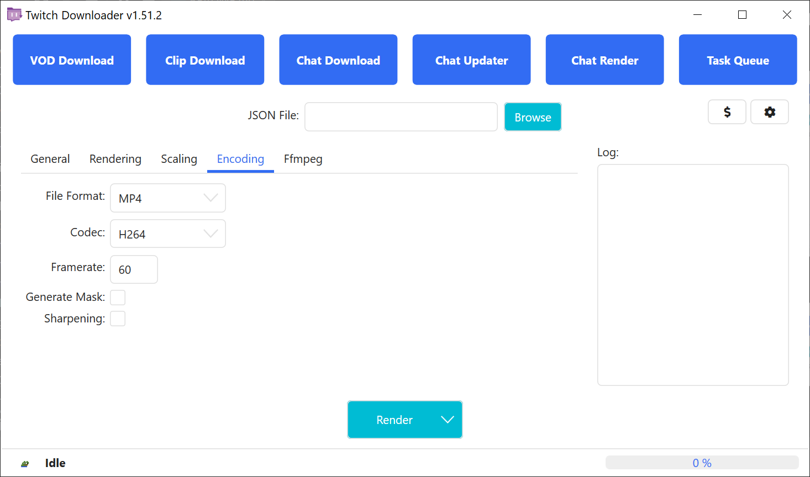
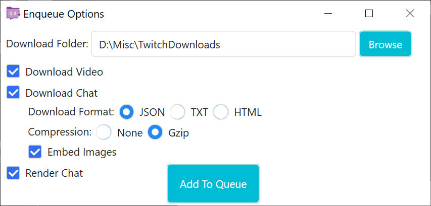

> [!WARNING]
> 此文档可能并非最新版本！
>
> 若过时、有缺漏或错误，以[英语版本](README.md)为准。

# TwitchDownloaderWPF

一款基于 Windows WPF 的桌面应用程序，实现了核心功能并集成了多种提升用户体验的实用功能。

## 目录

- [TwitchDownloaderWPF](#twitchdownloaderwpf)
  - [目录](#目录)
  - [使用方法](#使用方法)
    - [点播下载](#点播下载)
    - [剪辑下载](#剪辑下载)
    - [聊天下载](#聊天下载)
    - [聊天更新器](#聊天更新器)
    - [聊天渲染](#聊天渲染)
      - [常规](#常规)
      - [渲染](#渲染)
      - [比例](#比例)
      - [编码](#编码)
      - [FFmpeg](#ffmpeg)
      - [优化渲染速度](#优化渲染速度)
    - [任务队列](#任务队列)
    - [设置](#设置)
  - [故障排除](#故障排除)
    - [非错误问题](#非错误问题)
    - [常见错误](#常见错误)
    - [罕见错误](#罕见错误)
  - [本地化](#本地化)
  - [主题](#主题)

---

## 使用方法

大部分页面窗口左侧为信息区域，显示点播 / 剪辑的缩略图（若可用）、实况主、创建日期和标题；窗口中部包含人物设置；右侧为事件记录区域。

### 点播下载

从 Twitch 下载点播 / 精选内容。


<br><sup>*图 1.1*</sup>

要开始操作，请输入有效点播 / 精选内容链接 / ID。若内容为私有或订阅限定，则需提供具有访问权限账户的 OAuth 令牌。解锁下载选项后即可自定义任务。

<u>**Quality（画质）**</u>：选择下载画质并显示预估文件大小。Twitch 有时会将最高质量称为“Source”（源）而非常规分辨率格式（如图 1.1 所示的 1080p60）。

<u>**Trim Mode（裁剪模式）**</u>：设置视频裁剪处理方式。精确裁剪可能在前后几秒出现音视频卡顿；安全裁剪可避免卡顿，但可能使视频稍长。

<u>**Trim（裁剪）**</u>：以 [时] [分] [秒] 的格式设置裁剪起止时间。裁剪将减少总下载量。

<u>**Download Threads（下载线程）**</u>：启用的并行下载线程数量。

**OAuth**：用于下载订阅限定或私有视频的授权令牌。Twitch 要求此令牌以防止未授权下载付费 / 私有内容。获取 OAuth 令牌教程：[https://youtu.be/1MBsUoFGuls](https://www.youtube.com/watch?v=1MBsUoFGuls)。<ins>**请勿向任何人分享你的 OAuth 令牌！**</ins>

<u>**Download（下载）**</u>：开始下载任务。通过下拉菜单选择“*Enqueue（添加至队列）*”可将任务发送至[任务队列](#任务队列)。两种方式均使用当前下载设置。

### 剪辑下载

从 Twitch 下载剪辑。


<br><sup>*图 2.1*</sup>

要开始操作，请输入有效剪辑链接 / ID。解锁下载选项后即可自定义任务。

<u>**Quality（画质）**</u>：选择剪辑下载画质。

<u>**Encode Metadata（编码元数据）**</u>：使用 FFmpeg 将剪辑元数据（如直播日期和剪辑 ID）编码至最终 MP4 文件。

<u>**Download（下载）**</u>：开始下载任务。通过下拉菜单选择“*Enqueue（添加至队列）*”可将任务发送至[任务队列](#任务队列)。两种方式均使用当前下载设置。

### 聊天下载

Downloads the chat of a VOD, highlight, or clip.


<br><sup>*图 3.1*</sup>


<br><sup>*图 3.2*</sup>

要开始操作，请输入有效点播 / 精选内容 / 剪辑链接 / ID。解锁下载选项后即可自定义任务。若点播或精选内容为私有或订阅限定，则无法下载聊天。此为 Twitch API 限制，而非 TwitchDownloader。

<u>**Download Format（下载格式）**</u>：聊天保存格式。

- `JSON`：输出富文本聊天记录，可用于更新和渲染；
- `Text`：输出原始文本格式，适合观看视频时阅读；
- `HTML`：输出模拟 Twitch 网页界面的本地网页。

<u>**Compression（压缩）**</u>（仅 JSON）：使用 GZip 压缩标准减小文件体积（40-90%）。若需手动编辑聊天文件（不使用[聊天更新器](#聊天更新器)功能则不推荐启用）。

<u>**Timestamp Format（时间戳格式）**</u>（仅 Text）：文本下载中的时间戳格式。可选 `UTC`、`Relative`（视频相对时间）或 `None`（无）。

<u>**Trim（裁剪）**</u>：以 [时] [分] [秒] 的格式设置裁剪起止时间。裁剪将减少总下载量。

<u>**Embed Images（嵌入图片）**</u>（仅 JSON 和 HTML）：下载实况主表情和徽章并嵌入聊天文件。文件体积将显著增大。

<u>**3rd Party Emotes（第三方表情）**</u>（仅 JSON 和 HTML）：同时下载指定第三方平台的表情并嵌入聊天文件。若实况主未在平台注册则自动跳过。

<u>**Download Threads（下载线程）**</u>：启用的并行下载线程数量。部分网络环境下，Twitch 服务器可能限制仅使用 1 个线程。

<u>**Download（下载）**</u>：开始下载任务。通过下拉菜单选择“*Enqueue（添加至队列）*”可将任务发送至[任务队列](#任务队列)。两种方式均使用当前下载设置。

### 聊天更新器

更新 JSON 聊天文件中嵌入的表情、徽章、比特及裁剪范围，并 / 或将 JSON 聊天文件转换为另一种格式。


<br><sup>*图 4.1*</sup>

要开始操作，请点击“<u>**Browse（浏览）**</u>”按钮并选择先前下载的 JSON 聊天文件。解锁下载选项后即可自定义任务。若源视频仍存在，其信息将加载至信息区域。

<u>**Download Format（下载格式）**</u>：聊天保存格式。

- `JSON`：输出富文本聊天记录，可用于更新和渲染；
- `Text`：输出原始文本格式，适合观看视频时阅读；
- `HTML`：输出模拟 Twitch 网页界面的本地网页。

<u>**Compression（压缩）**</u>（仅 JSON）：使用 GZip 压缩标准减小文件体积（40-90%）。若需手动编辑聊天文件（不使用[聊天更新器](#聊天更新器)功能则不推荐启用）。

<u>**Timestamp Format（时间戳格式）**</u>（仅 Text）：文本下载中的时间戳格式。可选 `UTC`、`Relative`（视频相对时间）或 `None`（无）。

<u>**Trim（裁剪）**</u>：以 [时] [分] [秒] 的格式设置裁剪起止时间。扩大范围将尝试获取原下载未包含的聊天；缩小范围不会删除聊天。

<u>**Embed Missing（嵌入缺失项）**</u>（仅 JSON 和 HTML）：下载原始 JSON 未包含的表情或徽章。已有项不会被覆盖。

<u>**Replace Embeds（替换嵌入项）**</u>（仅 JSON 和 HTML）：丢弃原始 JSON 中所有现存表情和徽章并重新下载。

<u>**3rd Party Emotes（第三方表情）**</u>（仅 JSON 和 HTML）：同时下载指定第三方平台表情并嵌入聊天文件。若实况主未在平台注册则自动跳过。

<u>**Update（更新）**</u>：开始更新任务。通过下拉菜单选择“*Enqueue（添加至队列）*”可将任务发送至[任务队列](#任务队列)。两种方式均使用当前更新设置。

### 聊天渲染

将聊天 JSON 渲染为视频。


<br><sup>*图 5.1*</sup>


<br><sup>*图 5.2*</sup>


<br><sup>*图 5.3*</sup>


<br><sup>*图 5.4*</sup>


<br><sup>*图 5.5*</sup>


<br><sup>*图 5.6*</sup>

要开始操作，请点击“<u>**Browse（浏览）**</u>”按钮并选择先前下载的 JSON 聊天文件。随后即可通过渲染选项自定义任务。

**渲染**：开始渲染任务。通过下拉菜单选择“*Enqueue（添加至队列）*”可将任务发送至[任务队列](#任务队列)；选择“*Partial Render（部分渲染）*”可渲染聊天片段（见图 5.6）。所有方式均使用当前渲染设置。

#### <ins>常规</ins>

<u>**Width（宽度）**</u>：输出视频的宽（必须为偶数）。

<u>**Height（高度）**</u>：输出视频的高（必须为偶数）。

<u>**Font（字体）**</u>：输出视频所用字体（Twitch 网站使用 *Inter*，本工具内置为 *Inter Embedded*）。

<u>**Font Size（字体大小）**</u>：字体大小。

<u>**Font Color（字体颜色）**</u>：消息字体颜色。

<u>**Background Color（背景颜色）**</u>：输出视频背景颜色。

<u>**Alt Background Color（交替背景颜色）**</u>：消息替代背景颜色（需启用“*Alternate Backgrounds〔交替背景〕*”）。

#### <ins>渲染</ins>

<u>**Outline（边框）**</u>：为用户名和消息添加细黑边。

<u>**Timestamps（时间戳）**</u>：在消息旁显示相对于视频开始的时间。

<u>**Sub Messages（订阅消息）**</u>：渲染订阅、续订及礼物消息。禁用后将过滤此类消息。

<u>**Chat Badges（聊天徽章）**</u>：在用户名旁显示徽章。

<u>**Update Rate（更新频率）**</u>：绘制下批评论时间间隔（秒）。值越低聊天流越易读，但略微增加渲染时间。

<u>**Dispersion（离散化）**</u>：2022 年 11 月 Twitch API 变更后，聊天消息仅能按整秒下载。此选项尝试使用元数据还原消息实际发送时间，可能导致评论顺序变化（需将更新频率设置为小于 1.0 以获得有效效果）。

<u>**Alternate Backgrounds（交替背景）**</u>：隔行切换消息背景颜色以提高辨识度。

<u>**Increase Username Visibility（增强用户名可见性）**</u>：提高用户名与背景的对比度（类似于 Twitch 的“可读颜色”选项）。启用描边时，此选项将增强用户名与描边的对比度。

<u>**BTTV Emotes（BTTV 表情）**</u>：启用 BTTV 平台表情渲染。

<u>**FFZ Emotes（FFZ 表情）**</u>：启用 FFZ 平台表情渲染。

<u>**7TV Emotes（7TV 表情）**</u>：启用 7TV 平台表情渲染。

<u>**Offline（离线）**</u>：仅使用 JSON 中嵌入的信息和图片渲染（无网络请求）。

<u>**User Avatars（用户头像）**</u>：在渲染中显示用户头像。

<u>**Chat Badge Filter（聊天勋章过滤器）**</u>：不渲染指定徽章（例如图 5.2 中永不渲染“*No Autio / No Video〔无音频 / 无视频〕*”徽章）。

<u>**Ignore Users List（屏蔽用户列表）**</u>：逗号分隔、不区分大小写的用户列表（渲染时将移除）。例如图 5.2 将移除 Streamlabs、StreamElements 和 Nightbot。

<u>**Banned Words List（屏蔽词列表）**</u>：逗号分隔、不区分大小写的禁用词列表（包含这些词的消息将被移除）。例如图 5.2 将移除包含 `" pog "`、`"[pOg+"`、`"/POg9"` 的消息，但保留包含 `" poggers "` 的消息。

<u>**Emoji Vendor（Emoji 提供者）**</u>：渲染所用表情符号风格。支持 Twitter 的 *Twemoji*、Google 的 *Noto Color* 及系统默认表情（*None〔无〕*）。

#### <ins>比例</ins>

<u>**Emote Scale（表情比例）**</u>：表情缩放比例。

<u>**Badge Scale（徽章比例）**</u>：徽章缩放比例。

<u>**Emoji Scale（Emoji 比例）**</u>：Emoji 缩放比例。

<u>**Avatar Scale（头像比例）**</u>：头像缩放比例。

<u>**Outline Scale（描边比例）**</u>：描边粗细比例。

<u>**Vertical Spacing Scale（垂直间距比例）**</u>：消息间垂直间距比例。

<u>**Side Padding Scale（侧边距比例）**</u>：水平内边距比例。

<u>**Section Height Scale（区域高度比例）**</u>：单行文本高度比例。

<u>**Word Spacing Scale（词间距比例）**</u>：词语间水平间距比例。

<u>**Emote Spacing Scale（表情间距比例）**</u>：表情与表情 / 词语间的间距比例。

<u>**Highlight Stroke Scale（高亮描边比例）**</u>：高亮 / 订阅消息侧边栏宽度比例。

<u>**Highlight Indent Scale（高亮缩进比例）**</u>：高亮 / 订阅消息缩进比例。

#### <ins>编码</ins>

<u>**File Format（文件格式）**</u>：输出视频格式。

<u>**Codec（编解码器）**</u>：输出视频所用编解码器。

<u>**Framerate（帧速率）**</u>：输出视频帧速率。

<u>**Generate Mask（生成遮罩）**</u>：生成包含文本和图像黑白遮罩的副文件。背景颜色 Alpha 通道必须小于 255。

<u>**Sharpening（锐化）**</u>：对渲染视频应用锐化滤镜。略微增加渲染时间和文件大小（建议字体大小大于等于 24 时使用）。

#### <ins>FFmpeg</ins>

**警告：修改 FFmpeg 参数可能导致管道错误！**

<u>**Input Arguments（输入参数）**</u>：控制 FFmpeg 渲染输入的参数。

<u>**Output Arguments（输出参数）**</u>：控制 FFmpeg 编码输出的参数。

<u>**Reset To Defaults（重置为默认值）**</u>：重置 FFmpeg 参数至默认状态。

#### <ins>优化渲染速度</ins>

若渲染速度过慢，可尝试以下方式：

| 显著提升 | 中等提升 | 轻微提升 |
|-|-|-|
| 降低渲染宽度 | 禁用 BTTV、FFZ、7TV 表情 | 更新频率小于 1.0 时禁用离散化 |
| 降低渲染高度 | 提高更新频率 | 禁用订阅消息 |
| 降低帧速率 | 切换至系统 Emoji | 禁用描边 |
| 禁用生成遮罩 | | 禁用交替背景           |
| 禁用图像锐化 | | 禁用用户头像 |
| 切换编码器至 H.264 | | |

### 任务队列

创建并管理多个任务。


<br><sup>*图 6.1*</sup>


<br><sup>*图 6.2*</sup>


<br><sup>*图 6.3*</sup>


<br><sup>*图 6.4*</sup>


<br><sup>*图 6.5*</sup>

任务队列支持多个任务顺序或并行执行。其他 5 个页面的任务均可通过“*Enqueue（添加至队列）*”按钮发送至任务队列（见图 6.5）。

任务队列页面包含 4 类限制器：

<u>**VOD Downloads（点播下载）**</u>：同时进行的点播 / 精选内容下载任务数量。

<u>**Clip Downloads（剪辑下载）**</u>：同时进行的剪辑下载任务数量。

<u>**Chat Downloads（聊天下载）**</u>：同时进行的聊天下载 / 更新任务数量。

<u>**Chat Renders（聊天渲染）**</u>：同时进行的聊天渲染任务数量。

任务队列还支持 3 种批量下载模式：

<u>**URL List（URL 列表）**</u>：一个使用相同设置批量处理点播、精选内容、剪辑 URL 的列表（见图 6.2 和 6.5）。

<u>**Search VODs（搜索点播）**</u>：一个搜索实况主所有点播并使用相同设置批量处理的窗口（见图 6.3 和 6.5）。

<u>**Search Clips（搜索剪辑）**</u>：一个搜索实况主所有剪辑并使用相同设置批量处理的窗口（见图 6.3 和 6.5）。

### 设置

管理应用程序行为。


<br><sup>*图 7.1*</sup>

<u>**Cache Folder（缓存文件夹）**</u>：临时工作文件存储目录（含点播下载、表情、徽章等）。

- <u>**Clear（清除）**</u>：删除所有缓存文件（仅推荐异常时使用）。
- <u>**Browse（浏览）**</u>：选择新缓存目录（不迁移现有文件）。

<u>**Hide Donation Button（隐藏捐赠按钮）**</u>：隐藏捐赠按钮。

<u>**Time Format（时间格式）**</u>：控制界面和文件名模板中的时间显示格式。

<u>**Verbose Errors（详细错误）**</u>：启用错误时的详细弹窗提示。

<u>**Theme（主题）**</u>：应用程序主题（详见[主题](#主题)）。

<u>**Language（语言）**</u>：应用程序语言。（详见[本地化](#本地化)）。

<u>**Maximum Thread Bandwidth（最大线程宽带）**</u>：单个下载线程最大带宽（单位：KiB/s）。

<u>**Log Levels（日志级别）**</u>：启用不同日志级别以便于调试。

<u>**Download Filename Templates（下载文件名模板）**</u>：下载文件的默认命名模板。

<u>**Restore Defaults（重置为默认值）**</u>：重置所有设置（含各页面记忆设置）。重新启动后生效。

<u>**Save（保存）**</u>：保存当前设置并关闭窗口。

<u>**Cancel（取消）**</u>：放弃更改并关闭窗口。

## 故障排除

### 非错误问题

以下问题不属于应用程序错误，请附带复现步骤提交 [GitHub 议题](https://github.com/lay295/TwitchDownloader/issues)：

- 视频下载卡在 `99%` 超过 5 分钟
- 聊天渲染状态超过 10 秒未更新
- 渲染后聊天缺失消息
- UI 元素未响应主题切换
- 选项更改（如嵌入表情）未生效

### 常见错误

“常见错误”指任务开始前或启动后立即发生的错误，通常附带友好错误说明（可能含弹窗）。例如：

- 无法获取缩略图
  - 点播已过期或正在直播
- 无法获取视频 / 剪辑信息
  - 点播 / 剪辑无效、被移除、为私有或订阅限定视频未提供有效 OAuth
- 无法解析输入
  - 渲染输入无效（详见日志）

### 罕见错误

“罕见错误”表现为“致命错误”弹窗或不友好的错误信息。请附带复现步骤提交 [GitHub 议题](https://github.com/lay295/TwitchDownloader/issues)。例如：

- Error converting value 'XXX' to type 'XXX'. Path 'XXX', line #, position #.（类型转换错误）
- Cannot access child value on Newtonsoft.Json.Linq.JValue.（JSON 解析异常）
- Response status code does not indicate success：404 (Not Found).（网络响应异常）
- The pipe has been ended.（管道终止）
  - FFmpeg 异常。请重置参数后重试，若仍失败请提交议题。

为便于定位错误，请在[设置](#设置)中启用“详细错误”并截图保存“详细错误输出”弹窗。

## 本地化

本应用程序支持多语言，感谢社区成员的翻译贡献。

如果你对自己的翻译能力有信心，且 TwitchDownloaderWPF 尚未提供你的母语版本，或你的母语版本翻译尚不完整，我们诚邀你加入翻译团队！

如果你需要帮助，可以查阅提交 [53245be1fe55768d525905e81cc2cd0c12469b03](https://github.com/lay295/TwitchDownloader/blob/53245be1fe55768d525905e81cc2cd0c12469b03/TwitchDownloaderWPF/Services/AvailableCultures.cs)、查阅 [AvailableCultures.cs](Services/AvailableCultures.cs)、查阅原始[本地化讨论贴](https://github.com/lay295/TwitchDownloader/issues/445)、或提交[议题](https://github.com/lay295/TwitchDownloader/issues/new/choose)寻求帮助。

不确定的字符串可保留英文原文。

## 主题

> [!WARNING]
> 此部分相较于原文有所修改！
>
> 若过时、有缺漏或错误，以[英语版本](README.md#theming)为准。

此应用程序支持用户自定义主题！

要开始制作，只需复制其中一个内置主题，并用你喜欢的文本编辑器打开它。

HandyControl 元素不提供完整的主题支持，但它们包含一个深色变体，因此专门提供了布尔键。

布尔键控制：

- 标题栏主题
- HandyControl 元素主题
- …

SolidColorBrush 键控制颜色属性：

- 应用程序背景
- 文本颜色
- 边框颜色
- …

Inner 键用于为双递归元素添加视觉深度。以下图表说明了层次结构：

```层次结构图
+----------------------------[-][#][x]-+
|             AppBackground            |
| +----------------------------------+ |
| |       AppElementBackground       | |
| | +------------------------------+ | |
| | |   AppInnerElementBackground  | | |
| | +----------------------------- + | |
| +----------------------------------+ |
+--------------------------------------+
```  

使用示例：

- `AppElementBackground` 用于框架元素
- `AppInnerElementBackground` 用于带边框的标签、空白图像背景等。

如果你制作了一个主题并希望将其包含在官方发行版中，请提交 [GitHub 拉取请求](https://github.com/lay295/TwitchDownloader/pulls)。

重要注意事项：  

1. `Dark.xaml` 和 `Light.xaml` 将在应用程序启动时被覆盖。
2. 文件名不区分大小写（例如 `Dark.xaml` = `dark.xaml`）。
3. 编辑主题文件顶部的作者注释！

有关制作自定义主题的离线说明，请参阅 [Themes/README.txt](Themes/README.txt)，此文件会在每次运行时重新生成。
