> [!WARNING]
> 此檔案可能並非最新版本！
>
> 若過時、有缺漏或錯誤，以[英語版本](README.md)為準。

# TwitchDownloaderWPF

一款基於 Windows WPF 的桌面應用程式，實現了核心功能並整合了多種提升使用者體驗的實用功能。

## 目錄

- [TwitchDownloaderWPF](#twitchdownloaderwpf)
  - [目錄](#目錄)
  - [使用方法](#使用方法)
    - [點播下載](#點播下載)
    - [剪輯下載](#剪輯下載)
    - [聊天下載](#聊天下載)
    - [聊天更新器](#聊天更新器)
    - [聊天繪製](#聊天繪製)
      - [一般](#一般)
      - [繪製](#繪製)
      - [比例](#比例)
      - [編碼](#編碼)
      - [FFmpeg](#ffmpeg)
      - [最佳化繪製速度](#最佳化繪製速度)
    - [任務隊列](#任務隊列)
    - [設定](#設定)
  - [故障排除](#故障排除)
    - [非錯誤問題](#非錯誤問題)
    - [常見錯誤](#常見錯誤)
    - [罕見錯誤](#罕見錯誤)
  - [在地化](#在地化)
  - [主題](#主題)

---

## 使用方法

大部分頁面視窗左側為資訊區域，顯示點播 / 剪輯的縮圖（若可用）、實況主、建立日期和標題；視窗中部包含人物設定；右側為事件記錄區域。

### 點播下載

從 Twitch 下載點播 / 精選內容。

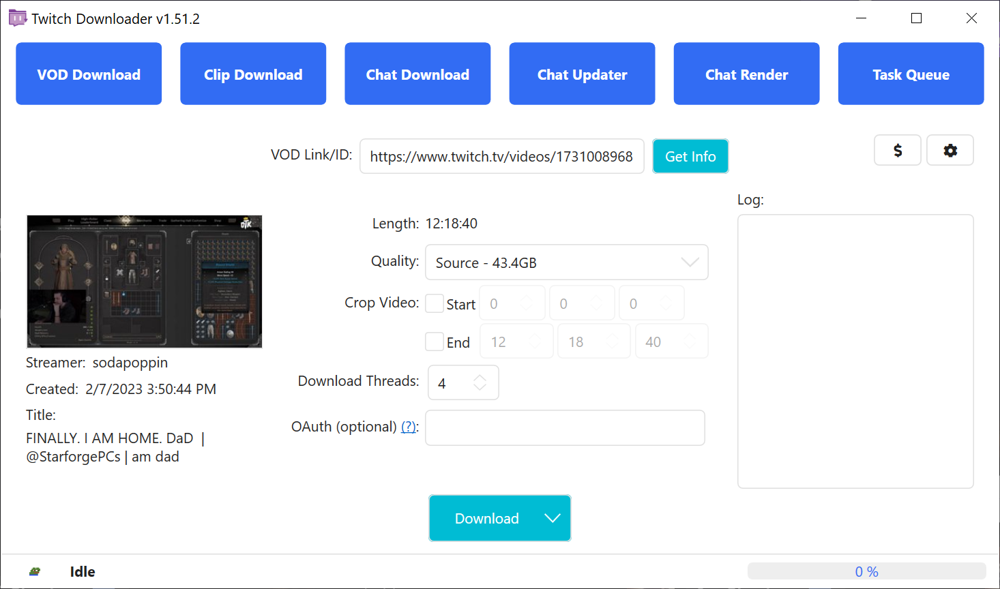
<br><sup>*圖 1.1*</sup>

要開始操作，請輸入有效點播 / 精選內容連結 / ID。若內容為私有或訂閱限定，則需提供具有訪問許可權帳戶的 OAuth 令牌。解鎖下載選項後即可自訂任務。

<ins>**Quality（畫質）**</ins>：選擇下載畫質並顯示預估檔案大小。Twitch 有時會將最高品質稱為“Source”（源）而非一般解析度格式（如圖 1.1 所示的 1080p60）。

<ins>**Trim Mode（裁剪模式）**</ins>：設定影片裁剪處理方式。精確裁剪可能在前後幾秒出現影音卡頓；安全裁剪可避免卡頓，但可能使影片稍長。

<ins>**Trim（裁剪）**</ins>：以 [時] [分] [秒] 的格式設定裁剪起止時間。裁剪將減少總下載量。

<ins>**Download Threads（下載執行緒）**</ins>：啟用的並行下載執行緒數量。

**OAuth**：用於下載訂閱限定或私有影片的授權令牌。Twitch 要求此令牌以防止未授權下載付費 / 私有內容。獲取 OAuth 令牌教學：[https://youtu.be/1MBsUoFGuls](https://www.youtube.com/watch?v=1MBsUoFGuls)。<ins>**請勿向任何人分享你的 OAuth 令牌！**</ins>

<ins>**Download（下載）**</ins>：開始下載任務。透過下拉選單選擇「*Enqueue（新增至隊列）*」可將任務傳送至[任務隊列](#任務隊列)。兩種方式均使用目前下載設定。

### 剪輯下載

從 Twitch 下載剪輯。

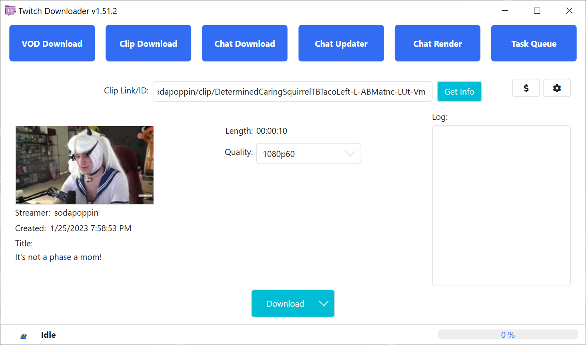
<br><sup>*圖 2.1*</sup>

要開始操作，請輸入有效剪輯連結 / ID。解鎖下載選項後即可自訂任務。

<ins>**Quality（畫質）**</ins>：選擇剪輯下載畫質。

<ins>**Encode Metadata（編碼中繼資料）**</ins>：使用 FFmpeg 將剪輯中繼資料（如直播日期和剪輯 ID）編碼至最終 MP4 檔案。

<ins>**Download（下載）**</ins>：開始下載任務。透過下拉選單選擇「*Enqueue（新增至隊列）*」可將任務傳送至[任務隊列](#任務隊列)。兩種方式均使用目前下載設定。

### 聊天下載

Downloads the chat of a VOD, highlight, or clip.


<br><sup>*圖 3.1*</sup>

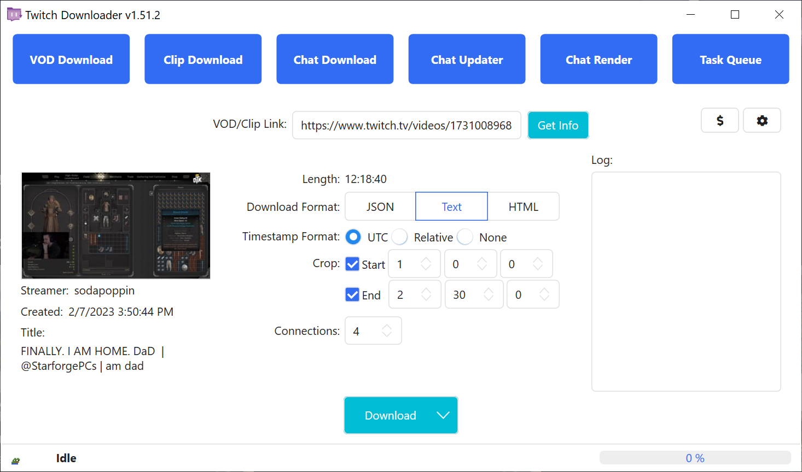
<br><sup>*圖 3.2*</sup>

要開始操作，請輸入有效點播 / 精華片段 / 剪輯連結 / ID。解鎖下載選項後即可自訂任務。若點播或精華片段為私有或訂閱限定，則無法下載聊天。此為 Twitch API 限制，而非 TwitchDownloader。

<ins>**Download Format（下載格式）**</ins>：聊天儲存格式。

- `JSON`：輸出富文字聊天記錄，可用於更新和繪製；
- `Text`：輸出原始文字格式，適合觀看影片時閱讀；
- `HTML`：輸出模擬 Twitch 網頁介面的本機網頁。

<ins>**Compression（壓縮）**</ins>（僅 JSON）：使用 GZip 壓縮標準減小檔案體積（40-90%）。若需手動編輯聊天檔案（不使用[聊天更新器](#聊天更新器)功能則不推薦啟用）。

<ins>**Timestamp Format（時間戳格式）**</ins>（僅 Text）：文字下載中的時間戳格式。可選 `UTC`、`Relative`（影片相對時間）或 `None`（無）。

<ins>**Trim（裁剪）**</ins>：以 [時] [分] [秒] 的格式設定裁剪起止時間。裁剪將減少總下載量。

<ins>**Embed Images（嵌入圖片）**</ins>（僅 JSON 和 HTML）：下載實況主表情和徽章並嵌入聊天檔案。檔案體積將顯著增大。

<ins>**3rd Party Emotes（第三方表情）**</ins>（僅 JSON 和 HTML）：同時下載指定第三方平臺的表情並嵌入聊天檔案。若實況主未在平臺註冊則自動跳過。

<ins>**Download Threads（下載執行緒）**</ins>：啟用的並行下載執行緒數量。部分網路環境下，Twitch 伺服器可能限制僅使用 1 個執行緒。

<ins>**Download（下載）**</ins>：開始下載任務。透過下拉選單選擇「*Enqueue（新增至隊列）*」可將任務傳送至[任務隊列](#任務隊列)。兩種方式均使用目前下載設定。

### 聊天更新器

更新 JSON 聊天檔案中嵌入的表情、徽章、位元及裁剪範圍，並 / 或將 JSON 聊天檔案轉換為另一種格式。

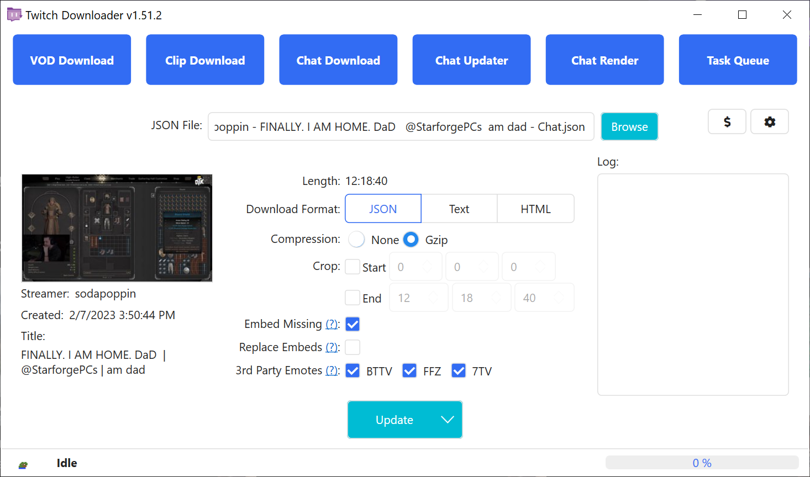
<br><sup>*圖 4.1*</sup>

要開始操作，請點選「<ins>**Browse（瀏覽）**</ins>」按鈕並選擇先前下載的 JSON 聊天檔案。解鎖下載選項後即可自訂任務。若源影片仍存在，其資訊將載入至資訊區域。

<ins>**Download Format（下載格式）**</ins>：聊天儲存格式。

- `JSON`：輸出富文字聊天記錄，可用於更新和繪製；
- `Text`：輸出原始文字格式，適合觀看影片時閱讀；
- `HTML`：輸出模擬 Twitch 網頁介面的本機網頁。

<ins>**Compression（壓縮）**</ins>（僅 JSON）：使用 GZip 壓縮標準減小檔案體積（40-90%）。若需手動編輯聊天檔案（不使用[聊天更新器](#聊天更新器)功能則不推薦啟用）。

<ins>**Timestamp Format（時間戳格式）**</ins>（僅 Text）：文字下載中的時間戳格式。可選 `UTC`、`Relative`（影片相對時間）或 `None`（無）。

<ins>**Trim（裁剪）**</ins>：以 [時] [分] [秒] 的格式設定裁剪起止時間。擴大範圍將嘗試獲取原下載未包含的聊天；縮小範圍不會刪除聊天。

<ins>**Embed Missing（嵌入缺失項）**</ins>（僅 JSON 和 HTML）：下載原始 JSON 未包含的表情或徽章。已有項不會被覆蓋。

<ins>**Replace Embeds（取代嵌入項）**</ins>（僅 JSON 和 HTML）：丟棄原始 JSON 中所有現存表情和徽章並重新下載。

<ins>**3rd Party Emotes（第三方表情）**</ins>（僅 JSON 和 HTML）：同時下載指定第三方平臺表情並嵌入聊天檔案。若實況主未在平臺註冊則自動跳過。

<ins>**Update（更新）**</ins>：開始更新任務。透過下拉選單選擇「*Enqueue（新增至隊列）*」可將任務傳送至[任務隊列](#任務隊列)。兩種方式均使用目前更新設定。

### 聊天繪製

將聊天 JSON 繪製為影片。

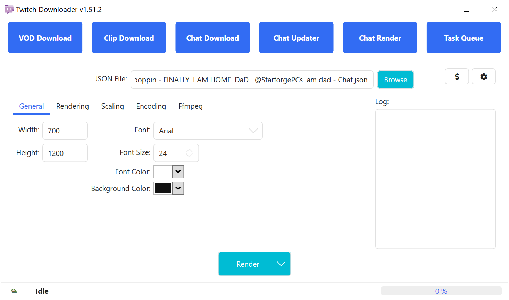
<br><sup>*圖 5.1*</sup>

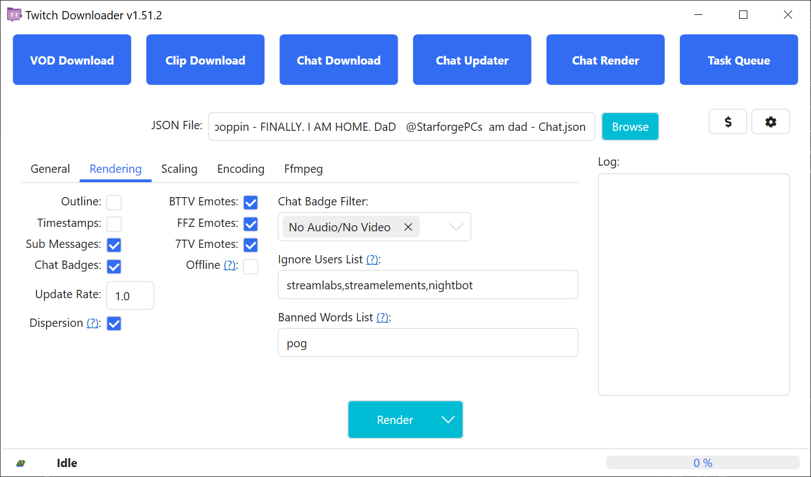
<br><sup>*圖 5.2*</sup>

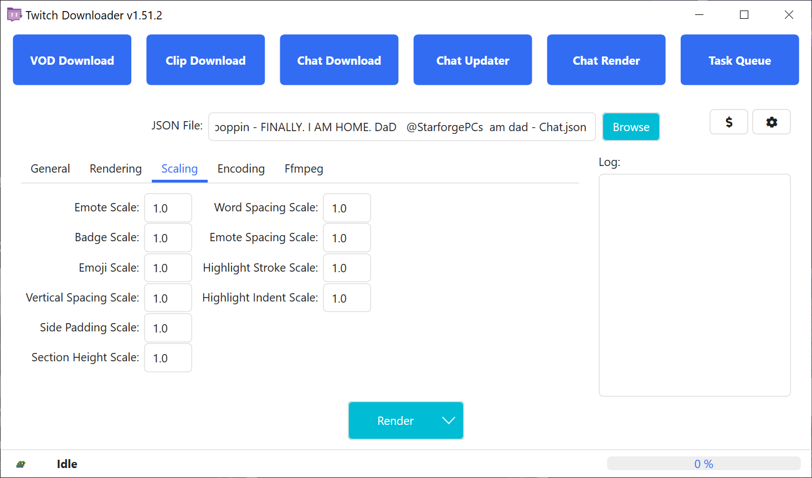
<br><sup>*圖 5.3*</sup>

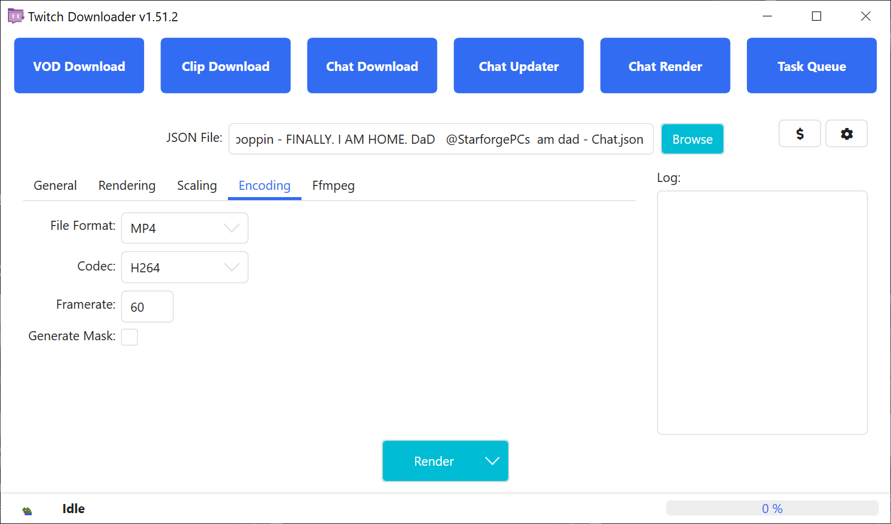
<br><sup>*圖 5.4*</sup>

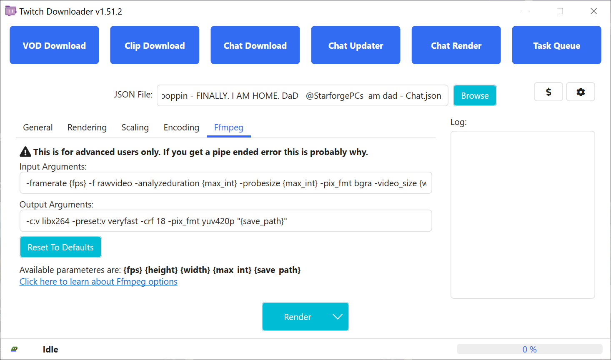
<br><sup>*圖 5.5*</sup>

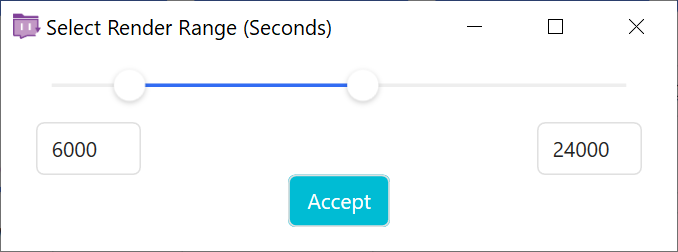
<br><sup>*圖 5.6*</sup>

要開始操作，請點選「<ins>**Browse（瀏覽）**</ins>」按鈕並選擇先前下載的 JSON 聊天檔案。隨後即可透過繪製選項自訂任務。

**繪製**：開始繪製任務。透過下拉選單選擇「*Enqueue（新增至隊列）*」可將任務傳送至[任務隊列](#任務隊列)；選擇「*Partial Render（部分繪製）*」可繪製聊天片段（見圖 5.6）。所有方式均使用目前繪製設定。

#### <ins>一般</ins>

<ins>**Width（寬度）**</ins>：輸出影片的寬（必須為偶數）。

<ins>**Height（高度）**</ins>：輸出影片的高（必須為偶數）。

<ins>**Font（字型）**</ins>：輸出影片所用字型（Twitch 網站使用 *Inter*，本工具內建為 *Inter Embedded*）。

<ins>**Font Size（字型大小）**</ins>：字型大小。

<ins>**Font Color（字型顏色）**</ins>：訊息字型顏色。

<ins>**Background Color（背景顏色）**</ins>：輸出影片背景顏色。

<ins>**Alt Background Color（交替背景顏色）**</ins>：訊息替代背景顏色（需啟用「*Alternate Backgrounds〔交替背景〕*」）。

#### <ins>繪製</ins>

<ins>**Outline（邊框）**</ins>：為使用者名稱和訊息新增細黑邊。

<ins>**Timestamps（時間戳）**</ins>：在訊息旁顯示相對於影片開始的時間。

<ins>**Sub Messages（訂閱訊息）**</ins>：繪製訂閱、續訂及禮物訊息。停用後將過濾此類訊息。

<ins>**Chat Badges（聊天徽章）**</ins>：在使用者名稱旁顯示徽章。

<ins>**Update Rate（更新頻率）**</ins>：繪製下批評論時間間隔（秒）。值越低聊天流越易讀，但略微增加繪製時間。

<ins>**Dispersion（離散化）**</ins>：2022 年 11 月 Twitch API 變更後，聊天訊息僅能按整秒下載。此選項嘗試使用中繼資料還原訊息實際傳送時間，可能導致評論順序變化（需將更新頻率設定為小於 1.0 以獲得有效效果）。

<ins>**Alternate Backgrounds（交替背景）**</ins>：隔行切換訊息背景顏色以提高辨識度。

<ins>**Increase Username Visibility（增強使用者名稱可見性）**</ins>：提高使用者名稱與背景的對比度（類似於 Twitch 的「可讀顏色」選項）。啟用描邊時，此選項將增強使用者名稱與描邊的對比度。

<ins>**BTTV Emotes（BTTV 表情）**</ins>：啟用 BTTV 平臺表情繪製。

<ins>**FFZ Emotes（FFZ 表情）**</ins>：啟用 FFZ 平臺表情繪製。

<ins>**7TV Emotes（7TV 表情）**</ins>：啟用 7TV 平臺表情繪製。

<ins>**Offline（離線）**</ins>：僅使用 JSON 中嵌入的資訊和圖片繪製（無網路請求）。

<ins>**User Avatars（使用者大頭貼）**</ins>：在繪製中顯示使用者大頭貼。

<ins>**Chat Badge Filter（聊天勳章過濾器）**</ins>：不繪製指定徽章（例如圖 5.2 中永不繪製「*No Autio / No Video〔無音訊 / 無影片〕*」徽章）。

<ins>**Ignore Users List（封鎖使用者列表）**</ins>：逗號分隔、不區分大小寫的使用者列表（繪製時將移除）。例如圖 5.2 將移除 Streamlabs、StreamElements 和 Nightbot。

<ins>**Banned Words List（封鎖詞列表）**</ins>：逗號分隔、不區分大小寫的停用詞列表（包含這些詞的訊息將被移除）。例如圖 5.2 將移除包含 `" pog "`、`"[pOg+"`、`"/POg9"` 的訊息，但保留包含 `" poggers "` 的訊息。

<ins>**Emoji Vendor（Emoji 提供者）**</ins>：繪製所用表情符號風格。支援 Twitter 的 *Twemoji*、Google 的 *Noto Color* 及系統預設表情（*None〔無〕*）。

#### <ins>比例</ins>

<ins>**Emote Scale（表情比例）**</ins>：表情縮放比例。

<ins>**Badge Scale（徽章比例）**</ins>：徽章縮放比例。

<ins>**Emoji Scale（Emoji 比例）**</ins>：Emoji 縮放比例。

<ins>**Avatar Scale（大頭貼比例）**</ins>：大頭貼縮放比例。

<ins>**Outline Scale（描邊比例）**</ins>：描邊粗細比例。

<ins>**Vertical Spacing Scale（垂直間距比例）**</ins>：訊息間垂直間距比例。

<ins>**Side Padding Scale（側邊距比例）**</ins>：水平內邊距比例。

<ins>**Section Height Scale（區域高度比例）**</ins>：單行文字高度比例。

<ins>**Word Spacing Scale（詞間距比例）**</ins>：詞語間水平間距比例。

<ins>**Emote Spacing Scale（表情間距比例）**</ins>：表情與表情 / 詞語間的間距比例。

<ins>**Highlight Stroke Scale（突顯描邊比例）**</ins>：突顯 / 訂閱訊息側邊欄寬度比例。

<ins>**Highlight Indent Scale（突顯縮排比例）**</ins>：突顯 / 訂閱訊息縮排比例。

#### <ins>編碼</ins>

<ins>**File Format（檔案格式）**</ins>：輸出影片格式。

<ins>**Codec（編解碼器）**</ins>：輸出影片所用編解碼器。

<ins>**Framerate（幀速率）**</ins>：輸出影片幀速率。

<ins>**Generate Mask（生成遮罩）**</ins>：生成包含文字和影像黑白遮罩的副檔案。背景顏色 Alpha 通道必須小於 255。

<ins>**Sharpening（銳化）**</ins>：對繪製影片應用銳化濾鏡。略微增加繪製時間和檔案大小（建議字型大小大於等於 24 時使用）。

#### <ins>FFmpeg</ins>

**警告：修改 FFmpeg 參數可能導致管道錯誤！**

<ins>**Input Arguments（輸入參數）**</ins>：控制 FFmpeg 繪製輸入的參數。

<ins>**Output Arguments（輸出參數）**</ins>：控制 FFmpeg 編碼輸出的參數。

<ins>**Reset To Defaults（重設為預設值）**</ins>：重設 FFmpeg 參數至預設狀態。

#### <ins>最佳化繪製速度</ins>

若繪製速度過慢，可嘗試以下方式：

| 顯著提升 | 中等提升 | 輕微提升 |
|-|-|-|
| 降低繪製寬度 | 停用 BTTV、FFZ、7TV 表情 | 更新頻率小於 1.0 時停用離散化 |
| 降低繪製高度 | 提高更新頻率 | 停用訂閱訊息 |
| 降低幀速率 | 切換至系統 Emoji | 停用描邊 |
| 停用生成遮罩 | | 停用交替背景 |
| 停用影像銳化 | | 停用使用者大頭貼 |
| 切換編碼器至 H.264 | | |

### 任務隊列

建立並管理多個任務。

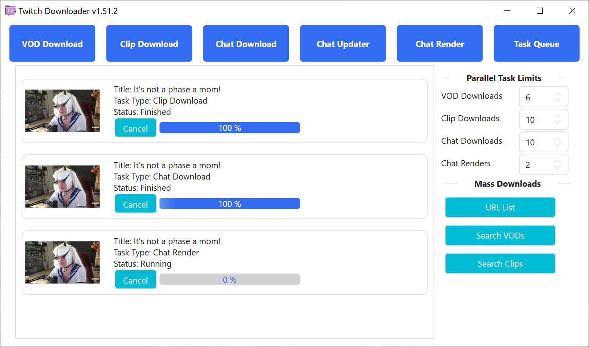
<br><sup>*圖 6.1*</sup>

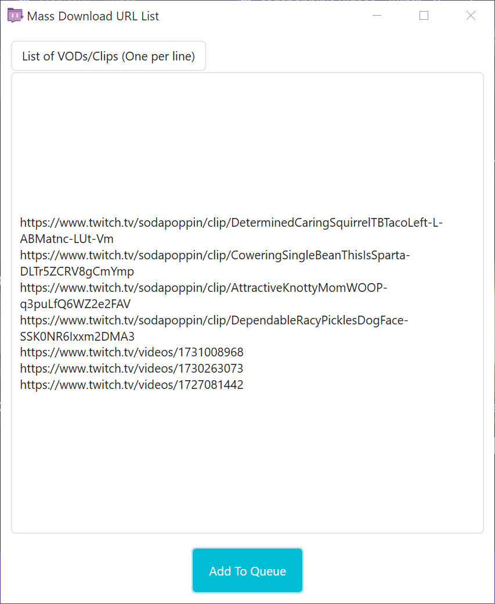
<br><sup>*圖 6.2*</sup>

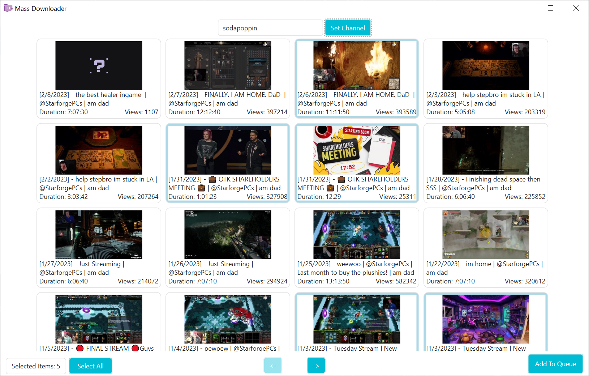
<br><sup>*圖 6.3*</sup>

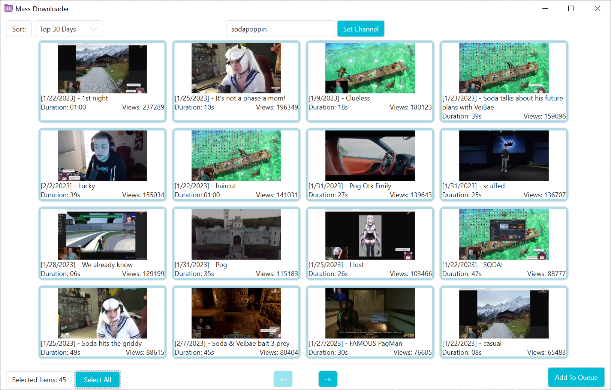
<br><sup>*圖 6.4*</sup>

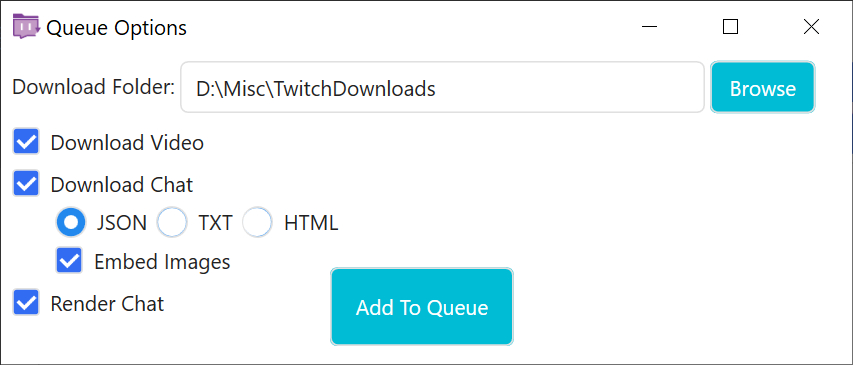
<br><sup>*圖 6.5*</sup>

任務隊列支援多個任務順序或並行執行。其他 5 個頁面的任務均可透過「*Enqueue（新增至隊列）*」按鈕傳送至任務隊列（見圖 6.5）。

任務隊列頁面包含 4 類限制器：

<ins>**VOD Downloads（點播下載）**</ins>：同時進行的點播 / 精華片段下載任務數量。

<ins>**Clip Downloads（剪輯下載）**</ins>：同時進行的剪輯下載任務數量。

<ins>**Chat Downloads（聊天下載）**</ins>：同時進行的聊天下載 / 更新任務數量。

<ins>**Chat Renders（聊天繪製）**</ins>：同時進行的聊天繪製任務數量。

任務隊列還支援 3 種批次下載模式：

<ins>**URL List（URL 列表）**</ins>：一個使用相同設定批次處理點播、精華片段、剪輯 URL 的列表（見圖 6.2 和 6.5）。

<ins>**Search VODs（搜尋點播）**</ins>：一個搜尋實況主所有點播並使用相同設定批次處理的視窗（見圖 6.3 和 6.5）。

<ins>**Search Clips（搜尋剪輯）**</ins>：一個搜尋實況主所有剪輯並使用相同設定批次處理的視窗（見圖 6.3 和 6.5）。

### 設定

管理應用程式行為。

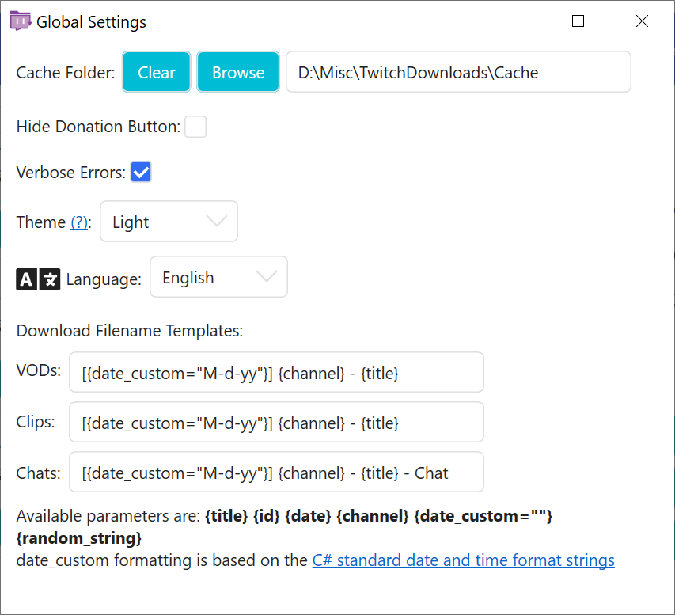
<br><sup>*圖 7.1*</sup>

<ins>**Cache Folder（快取資料夾）**</ins>：臨時工作檔案儲存目錄（含點播下載、表情、徽章等）。

- <ins>**Clear（清除）**</ins>：刪除所有快取檔案（僅推薦異常時使用）。
- <ins>**Browse（瀏覽）**</ins>：選擇新快取目錄（不遷移現有檔案）。

<ins>**Hide Donation Button（隱藏捐贈按鈕）**</ins>：隱藏捐贈按鈕。

<ins>**Time Format（時間格式）**</ins>：控制介面和檔案名模板中的時間顯示格式。

<ins>**Verbose Errors（詳細錯誤）**</ins>：啟用錯誤時的詳細彈出視窗提示。

<ins>**Theme（主題）**</ins>：應用程式主題（詳見[主題](#主題)）。

<ins>**Language（語言）**</ins>：應用程式語言。（詳見[在地化](#在地化)）。

<ins>**Maximum Thread Bandwidth（最大執行緒寬頻）**</ins>：單個下載執行緒最大頻寬（單位：KiB/s）。

<ins>**Log Levels（日誌級別）**</ins>：啟用不同日誌級別以便於除錯。

<ins>**Download Filename Templates（下載檔案名模板）**</ins>：下載檔案的預設命名模板。

<ins>**Restore Defaults（重設為預設值）**</ins>：重設所有設定（含各頁面記憶設定）。重新啟動後生效。

<ins>**Save（儲存）**</ins>：儲存目前設定並關閉視窗。

<ins>**Cancel（取消）**</ins>：放棄更改並關閉視窗。

## 故障排除

### 非錯誤問題

以下問題不屬於應用程式錯誤，請附帶復現步驟提交 [GitHub Issue](https://github.com/lay295/TwitchDownloader/issues)：

- 影片下載卡在 `99%` 超過 5 分鐘
- 聊天繪製狀態超過 10 秒未更新
- 繪製後聊天缺失訊息
- UI 元素未響應主題切換
- 選項更改（如嵌入表情）未生效

### 常見錯誤

「常見錯誤」指任務開始前或啟動後立即發生的錯誤，通常附帶友好錯誤說明（可能含彈出視窗）。例如：

- 無法獲取縮圖
  - 點播已過期或正在直播
- 無法獲取影片 / 剪輯資訊
  - 點播 / 剪輯無效、被移除、為私有或訂閱限定影片未提供有效 OAuth
- 無法解析輸入
  - 繪製輸入無效（詳見日誌）

### 罕見錯誤

「罕見錯誤」表現為「致命錯誤」彈出視窗或不友好的錯誤資訊。請附帶復現步驟提交 [GitHub Issue](https://github.com/lay295/TwitchDownloader/issues)。例如：

- Error converting value 'XXX' to type 'XXX'. Path 'XXX', line #, position #.（型別轉換錯誤）
- Cannot access child value on Newtonsoft.Json.Linq.JValue.（JSON 解析異常）
- Response status code does not indicate success：404 (Not Found).（網路響應異常）
- The pipe has been ended.（管道終止）
  - FFmpeg 異常。請重設參數後重試，若仍失敗請提交 Issue。

為便於定位錯誤，請在[設定](#設定)中啟用「詳細錯誤」並截圖儲存「詳細錯誤輸出」彈出視窗。

## 在地化

本應用程式支援多語言，感謝社群成員的翻譯貢獻。

如果你對自己的翻譯能力有信心，且 TwitchDownloaderWPF 尚未提供你的母語版本，或你的母語版本翻譯尚不完整，我們誠邀你加入翻譯團隊！

如果你需要幫助，可以查閱 commit [53245be1fe55768d525905e81cc2cd0c12469b03](https://github.com/lay295/TwitchDownloader/blob/53245be1fe55768d525905e81cc2cd0c12469b03/TwitchDownloaderWPF/Services/AvailableCultures.cs)、查閱 [AvailableCultures.cs](Services/AvailableCultures.cs)、查閱原始[在地化討論貼](https://github.com/lay295/TwitchDownloader/issues/445)、或提交 [Issue](https://github.com/lay295/TwitchDownloader/issues/new/choose) 尋求幫助。

不確定的字串可保留英文原文。

## 主題

> [!WARNING]
> 此部分相較於原文有所修改！
>
> 若過時、有缺漏或錯誤，以[英語版本](README.md#theming)為準。

此應用程式支援使用者自訂主題！

要開始製作，只需複製其中一個內建主題，並用你喜歡的文字編輯器開啟它。

HandyControl 元素不提供完整的主題支援，但它們包含一個深色變體，因此專門提供了布林鍵。

布林鍵控制：

- 標題欄主題
- HandyControl 元素主題
- …

SolidColorBrush 鍵控制顏色屬性：

- 應用程式背景
- 文字顏色
- 邊框顏色
- …

Inner 鍵用於為雙遞迴元素新增視覺深度。以下圖表說明了層次結構：

```層次結構圖
+----------------------------[-][#][x]-+
|             AppBackground            |
| +----------------------------------+ |
| |       AppElementBackground       | |
| | +------------------------------+ | |
| | |   AppInnerElementBackground  | | |
| | +----------------------------- + | |
| +----------------------------------+ |
+--------------------------------------+
```  

使用範例：

- `AppElementBackground` 用於框架元素
- `AppInnerElementBackground` 用於帶邊框的標籤、空白影像背景等。

如果你製作了一個主題並希望將其包含在官方 Release 中，請提交 [GitHub Pull Request](https://github.com/lay295/TwitchDownloader/pulls)。

重要注意事項：  

1. `Dark.xaml` 和 `Light.xaml` 將在應用程式啟動時被覆蓋。
2. 檔案名不區分大小寫（例如 `Dark.xaml` = `dark.xaml`）。
3. 編輯主題檔案頂部的作者註釋！

有關製作自訂主題的離線說明，請參閱 [Themes/README.txt](Themes/README.txt)，此檔案會在每次執行時重新生成。
